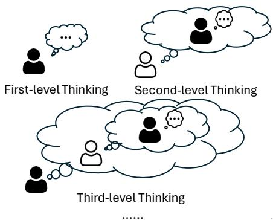
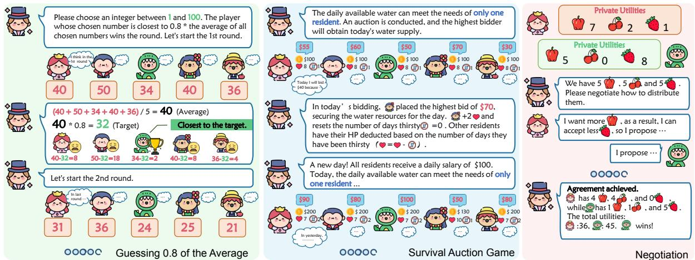
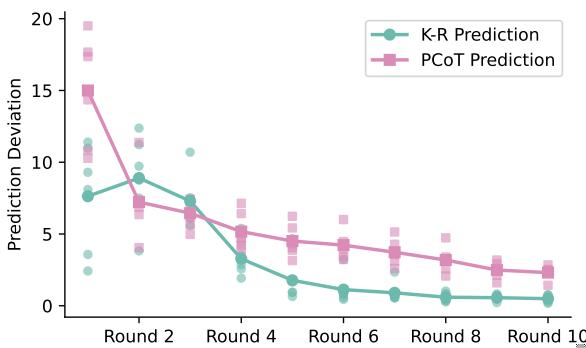
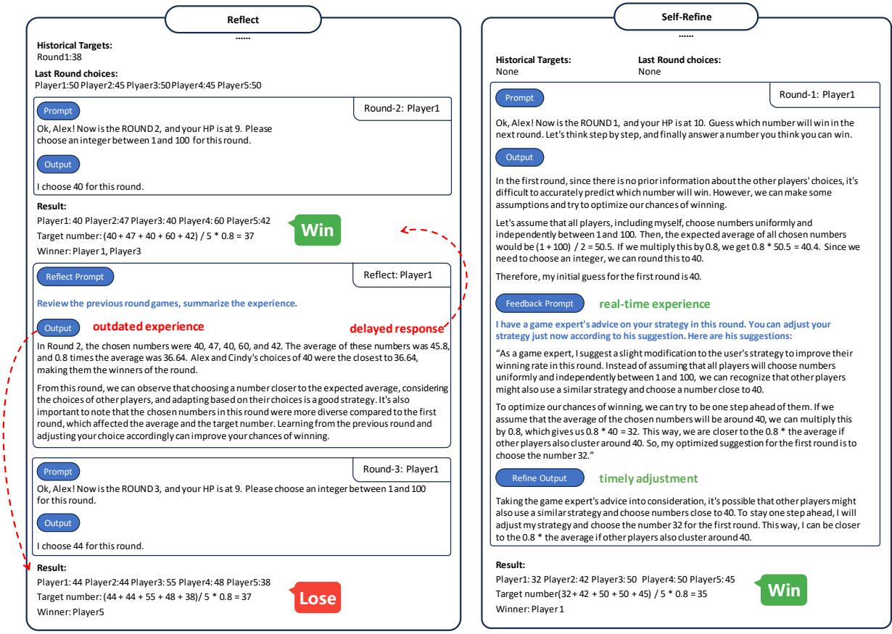
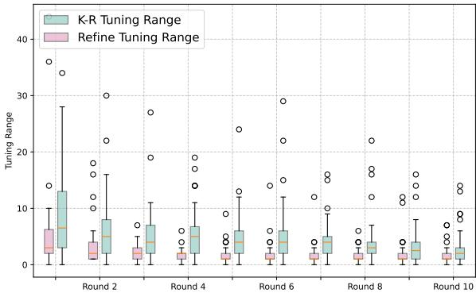

# K-Level Reasoning: Establishing Higher Order Beliefs in Large Language Models for Strategic Reasoning

Yadong Zhang1,2,\*, Shaoguang $\mathbf { M } \mathbf { a } \mathbf { o } ^ { 2 , \dag }$ , Tao $\mathbf { G e } ^ { 2 }$ , Xun Wang2, Yan Xia2, Man Lan1, Furu Wei2,

1East China Normal University, 2Microsoft Research Asia

# Abstract

Strategic reasoning is a complex yet essential capability for intelligent agents. It requires Large Language Model (LLM) agents to adapt their strategies dynamically in multi-agent environments. Unlike static reasoning tasks, success in these contexts depends on anticipating other agents’ beliefs and actions while continuously adjusting strategies to achieve individual goals. LLMs and LLM agents often struggle with strategic reasoning due to the absence of a reasoning framework that enables them to dynamically infer others’ perspectives and adapt to changing environments. Inspired by the Level-K framework 1 from game theory and behavioral economics, which extends reasoning from simple reactions to structured strategic depth, we propose a novel framework: "KLevel Reasoning with Large Language Models (K-R)." This framework employs recursive mechanisms to enable LLMs to achieve varying levels of strategic depth, allowing agents to form higher order beliefs—beliefs about others’ beliefs. We validate this framework through rigorous testing on four testbeds: two classical game theory problems and two social intelligence tasks. The results demonstrate the advantages of K-R in strategic reasoning. Our work presents the first recursive implementation of strategic depth in large language models (LLMs). It establishes a foundation for future research into theory of mind and strategic reasoning in LLMs.

# 1 Introduction

Strategic reasoning—decision-making in multiparticipant environments—presents unique challenges for Large Language Models (LLMs) and LLM agents(Zhang et al., 2024b). In these settings, agents must respond to the actions of others while adapting to dynamic environments. They also need to align their decisions with their own goals during these interactions. Strategic reasoning is essential for intelligent agents and is widely applied in realworld tasks, such as investment, business strategy making(Zhao et al., 2023), negotiation(Hua et al., 2023), and policy-making(Li et al., 2024).

  
Figure 1: Level-K Framework: In first-level thinking, agents respond directly to the environment. In secondlevel thinking, agents consider the first-level thinking of others. This process continues iteratively, with agents forming higher order beliefs based on assumptions about others’ thoughts.

Effective strategic reasoning relies on understanding others’ perspectives and anticipating their strategies. While there are some research efforts on LLMs’ strategic reasoning, most methods rely on static prompting (Fu et al., 2023; Xu et al., 2023b). This typically involves instructing the model to account for others’ beliefs and decisions during its own decision-making process in the prompt. However, these approaches fall short in enabling LLMs to form true higher order beliefs—beliefs about what others believe, and lack the flexibility needed for deeper strategic reasoning.

K-level thinking (Figure 1) (Nagel, 1995; Cui et al., 2021), a classical concept in behavioral economics and game theory, categorizes reasoning into varying depths of strategic thought. It involves not only predicting others’ actions but also considering their beliefs about one’s actions, and even further layers of recursive thinking.

  
Figure 2: The illustration of three reasoning problems in dynamic, interactive environments in this paper. Left: Guessing 0.8 of the Average; Middle: Survival Auction Game; Right: Negotiation.

Inspired by K-level thinking, we propose a novel strategic reasoning framework termed "K-Level Reasoning with LLMs (K-R)." K-R organizes reasoning into hierarchical levels and employs a recursive mechanism to integrate varying strategic depth into decision-making. Specifically, it involves: 1) recursively anticipating others’ actions at varying levels of strategic depth with environmental context and historical public information, and 2) reasoning the optimal action based on these anticipations. To the best of our knowledge, this is the first approach to implementing varying levels of strategic depth in LLMs using a recursive mechanism and enables deeper reasoning in LLM agents through an algorithmic framework.

We validate this framework through rigorous testing on four testbeds: two classical game theory problems and two social intelligence tasks. The game theory problems includes Guessing 0.8 of the Average (Figure 2 left) and Survival Auction Game (Mao et al., 2023) (Figure 2 middle). The social intelligence tasks includes Negotiation (Cao et al., 2018) (Figure 2 right) and SOTOPIA benchmark(Zhou et al., 2024). These settings serve as microcosms of the complex decision-making processes involved in strategic reasoning. Through extensive experiments, we demonstrate that our framework significantly outperforms existing reasoning methods and flexibly achieves varying levels of strategic depth. In addition to empirical evidence, we provide a theoretical analysis highlighting the benefits of K-R. We show that, leveraging the in-context learning capabilities of LLMs, K-R can effectively model opponents’ behavior using accumulated public and available opponent information.

Furthermore, we align the strategic depth of LLMs with human participants (Nagel, 1995; Bosch-Domenech et al., 2002). Using human as anchors, we observe that the K-R significantly enhances the strategic depth of LLMs from 0.25 to 1.89. Notably, when ${ \mathrm { K } } { = } 3$ , the strategic depth (1.89) of the LLM closely approaches that of financial newspaper readers (1.91). This strongly indicates that K-R establishes higher order beliefs in LLMs for strategic reasoning.

The contributions of this work are as follows:

• We introduce K-R, a novel framework that extends k-level thinking to LLMs, enabling flexible strategic reasoning at varying depths through a recursive mechanism. • We conduct extensive evaluations, including game theory and social intelligence problems, demonstrating that K-R significantly outperforms existing methods in terms of flexibility and effectiveness, across both closed-source and open-source models. • We provide an in-depth analysis of K-R, confirming its ability to build higher order beliefs and enhance strategic reasoning. This lays a foundation for future research in theory of mind and strategic reasoning in LLMs.

# 2 K-Level Reasoning with Large Language Models

# 2.1 Methodology

Strategic reasoning requires considering both the decision context and the possible actions of other participants.We employ a multi-round normal form multi-participant game to introduce the proposed method. In this setting, an agent’s decision-making process is formalized as follows: each agent $i$ selects an action $a _ { i } ^ { t }$ from a set $A _ { i } ^ { t }$ at timestep $t$ . The payoff for agent $i$ , resulting from the collective action profile $\mathbf { A } ^ { t } = ( a _ { 1 } ^ { t } , a _ { 2 } ^ { t } , . . . , a _ { N } ^ { t } )$ and environment $E ^ { t }$ , is denoted as $U _ { i } ( E ^ { t } , \mathbf { A } ^ { t } )$ .

At $k = 1$ , agents decide based on environment $E ^ { t }$ without strategic anticipation:

$$
a _ { i } ^ { t , 1 } = \arg \operatorname* { m a x } _ { a _ { i } \in A _ { i } ^ { t } } \mathbb { E } [ U _ { i } ( E ^ { t } , a _ { i } ) ]
$$

At higher level thinking $\left( k \geq 2 \right)$ ), agent $i$ simulates other agents operating at level $k - 1$ and adjusts their strategy accordingly2:

$$
a _ { i } ^ { t , k } = \arg \operatorname* { m a x } _ { a _ { i } \in A _ { i } ^ { t } } \mathbb { E } [ U _ { i } ( E ^ { t } , a _ { i } , \hat { a } _ { - i } ^ { t , k - 1 } ) ]
$$

where $\hat { a } _ { - i } ^ { t , k - 1 }$ are the predicted actions of other agents based on their $k - 1$ level reasoning.

We propose a novel strategic reasoning framework with recursive mechanisms, termed “KLevel Reasoning with Large Language Models (K-R),” involving 1) recursively anticipating the actions $\hat { a } _ { - i } ^ { t , k }$ of others at different thinking levels using environment contexts and historical public information, followed by 2) reasoning the optimal action at,i based on anticipation of others’ actions.

The K-Level Reasoning process is formulated as follows:

# 1) Anticipation:

$$
\hat { a } _ { j } ^ { t , m } = \left\{ \begin{array} { l l } { \mathbf { L L M } ( E ^ { t } , H _ { j } ^ { t } ) } & { \mathrm { i f } m = 1 } \\ { \mathbf { L L M } ( E ^ { t } , H _ { j } ^ { t } , \hat { a } _ { - j } ^ { t , m - 1 } ) } & { \mathrm { i f } m > 1 } \end{array} \right.
$$

where $\mathcal { H } _ { j } ^ { t } = \{ ( E ^ { 1 } , a _ { j } ^ { 1 } ) , ( E ^ { 2 } , a _ { j } ^ { 2 } ) , . . . , ( E ^ { t - 1 } , a _ { j } ^ { t - 1 } ) \}$ represents public historical data of agent $j$ , and $m$ denotes the specified thinking level.

2) Reasoning:

$$
a _ { i } ^ { t , k } = \operatorname { L L M } ( E ^ { t } , H _ { i } ^ { t } , \hat { a } _ { - i } ^ { t , k - 1 } )
$$

Algorithm 1 outlines the implementation of K-R. This recursive method enables flexible and progressively deeper strategic reasoning $( 1 , 2 , . . . , k , k +$ $1 , \ldots )$ , thereby enhancing higher order belief in LLM agents.

Require: $E ^ { t }$ : Current decision context at time $t$ $H _ { i } ^ { t }$ : Historical information up to time $t$ for agent $i$ ; $K$ : Depth of strategic reasoning;   
Ensure: at,Ki : Action for agent i at time t after K-level reasoning.   
1: Function $K \_ R E A S O N I N G ( i , k )$ :   
2: if $k = = 1$ then   
3: return $\mathrm { L L M } ( E ^ { t } , H _ { i } ^ { t } )$   
4: else   
5: for each agent $j \neq i$ do   
6: $\hat { a } _ { j } ^ { t , k - 1 } = K \_ R E A S O N I N G ( j , k - 1 )$   
7: end for   
8: return $\mathrm { L L M } ( E ^ { t } , H _ { i } ^ { t } , \{ \hat { a } _ { j } ^ { t , k - 1 } \mid j \neq i \} )$   
9: end if   
10: $a _ { i } ^ { t , K } = K \_ R E A S O N I N \mathbf { G } ( i , K )$   
11: return $a _ { i } ^ { t , K }$

# 2.2 Theoretical Analysis

This section discusses the benefits from K-R from a theoretical perspective. We utilize the in-context learning capabilities of LLMs to effectively model opponents’ behavior. Suppose agent $j$ ’s decisionmaking process follows a hidden strategy $\theta _ { j } ^ { * }$ . Thus, agent $j$ ’s decision-making can be expressed as:

$$
P ( a _ { j } ^ { t } \mid E ^ { t } , \theta _ { j } ^ { \ast } )
$$

The in-context learning of LLMs can be formally defined as implicit Bayesian inference(Xie et al., 2021); therefore, given the environment $E ^ { t }$ , the next action prediction conditioned on $H _ { j } ^ { t }$ is:

$$
P ( a _ { j } ^ { t } \mid E ^ { t } , H _ { j } ^ { t } ) = \int P ( a _ { j } ^ { t } \mid E ^ { t } , \theta _ { j } ) P ( \theta _ { j } \mid H _ { j } ^ { t } ) d \theta _ { j }
$$

As $t \to \infty$ , by the law of large numbers and properties of Bayesian updating, the posterior distribution concentrates around the true parameter $\theta _ { j } ^ { * }$ :

$$
P ( \theta _ { j } \mid H _ { j } ^ { t } )  \delta ( \theta _ { j } - \theta _ { j } ^ { * } )
$$

where $\delta$ is the Dirac delta function. Therefore,

$$
\int P ( a _ { j } ^ { t } \mid E ^ { t } , \theta _ { j } ) P ( \theta _ { j } \mid H _ { j } ^ { t } ) d \theta _ { j }  P ( a _ { j } ^ { t } \mid E ^ { t } , \theta _ { j } ^ { * } )
$$

This implies that as the number of interactions increases, K-R can more accurately predict opponents’ behavior.

It is also worth noting that interaction data cannot be infinite, and in-context learning is related to

the performance of large language models (LLMs). Therefore, we empircally validate these hypotheses and reasoning in Section 5.2.

# 3 Experiments: Game Theory

To fairly compare the strategic reasoning capabilities of LLMs, we first adopt two widely used game theory settings. These controlled, well-defined game theory problems provide a robust assessment of LLMs’ performance, with detailed setups outlined in Appendix B.

# 3.1 Task Definition and Metrics

# 3.1.1 Guessing 0.8 of the Average (G0.8A)

G0.8A (Figure 2 Left) is a classic game theory problem introduced by Alain Ledoux (Ledoux, 1981). It involves 10-round games where each player selects a number between 1 and 100. The objective is to choose a number closest to $80 \%$ of the group’s average choice. The key idea is to guess how others will estimate the average and decide the number to submit. This concept is also illustrated in the Keynesian Beauty Contest (Keynes, 1936). This game mirrors the challenge of anticipating collective behavior in financial markets, where investors must predict not only the value of an asset but also how others will value it in the future.

The performance of the agent is evaluated using the Win Rate. Specifically, the Win Rate is calculated based on the wins achieved by the agent in individual round, rather than an entire game episode.

Standard Prompting (Direct): This is the conventional prompting method in which the LLM generates the final answer (Action) in response to the given game setting prompt.

Chain-of-Thought (CoT) (Wei et al., 2022): We employ the zero-shot Chain-of-Thought reasoning method (Kojima et al., 2022).

Persona Prompting (Persona) (Deshpande et al., 2023): This technique modifies the standard prompting process by incorporating a “Game Expert” persona to enhance the reasoning capabilities of the LLM.

Reflexion (Reflect) (Shinn et al., 2023): This method refers to language agents with verbal reinforcement learning and has been adapted for dynamic tasks. Detailed modifications are explained in K.

Self-Refine (Refine) (Madaan et al., 2023): This is a multi-round iterative reasoning approach where an additional LLM offers comments and adjustments prior to reaching a final decision. The distinctions between Self-Refine and Reflect are elaborated upon in the Appendix I.

Prediction Chain of Thought (PCoT): This strong baseline diverges from CoT by requiring the LLM to explicitly predict opponents’ actions before making decisions. Unlike K-Level Reasoning, which involves a recursive approach, PCoT focuses on direct prediction based on context.

For implementation details and specific examples, please refer to Appendix K.

# 3.1.2 Survival Auction Game (SAG)

SAG (Figure 2 Middle) is derived from the Water Allocation Challenge proposed in (Mao et al., 2023). Each resident’s goal is to survive a 10-day drought period by bidding for water resources and maintaining health points above zero. If a player successfully bids for water, they gain health points; otherwise, they lose health points. This integration of the auction system with the health points mechanism creates a dynamic environment where players must balance health and finances.

We use Average Survival Round measures the mean round in which a player remains active in the game.

# 3.2 Base Techniques

We adapt a variety of approaches, originally from traditional reasoning and agent benchmarks. These base techniques include:

# 3.3 Experimental Settings

We established a controllable environment and distinguished between two roles: the player (primary focus) and the opponents. The player is equipped with a specific method, while all opponents use another reasoning approach. This well-defined setting allows for a clearer comparison of reasoning capabilities between methods.

In G0.8A and SAG, there is one player and four opponents for each game. Experiments for each setting are repeated 10 times and have passed the significance test (Appendix H), and each experiment consists of a 10-round game.

All methods in main experiments were implemented using GPT-4 (Achiam et al., 2023) (gpt4- 32k), with the temperature set at 0.7 and the top-p set at 0.9. We also conducted experiments with open-source LLMs, Details of which are provided in Appendix E. Unless specified otherwise, the level of thinking in K-Level Reasoning is set to ${ \tt K } = 2$ .

# 3.4 Results

To distinguish between “Player” and “Opponent” in the table, the headers for Player (bold) and Opponents (italics) are formatted accordingly.

Table 1: Win Rate of the player against different opponents in G0.8A game.   

<table><tr><td></td><td>Direct</td><td>CoT</td><td>Persona Reflect Refine PCoT</td><td></td><td></td><td></td><td>K-R</td></tr><tr><td rowspan="4">Direct CoT Persona Reflect</td><td>0.43</td><td>0.67</td><td>0.62</td><td>0.53</td><td>0.43</td><td>0.61</td><td>0.82</td></tr><tr><td>0.07</td><td>0.32</td><td>0.35</td><td>0.14</td><td>0.22</td><td>0.45</td><td>0.63</td></tr><tr><td>0.05</td><td>0.37</td><td>0.29</td><td>0.05</td><td>0.37</td><td>0.11</td><td>0.46</td></tr><tr><td>0.42</td><td>0.68</td><td>0.63</td><td>0.39</td><td>0.64</td><td>0.74</td><td>0.78</td></tr><tr><td rowspan="4">Refine PCoT K-R</td><td>0.10</td><td>0.34</td><td>0.32</td><td>0.31</td><td>0.23</td><td>0.22</td><td>0.46</td></tr><tr><td>0.03</td><td>0.44</td><td>0.52</td><td>0.21</td><td>0.51</td><td>0.54</td><td>0.85</td></tr><tr><td>0.04</td><td>0.15</td><td>0.14</td><td>0.04</td><td>0.17</td><td>0.14</td><td>0.52</td></tr><tr><td>Average 0.18 0  2149</td><td></td><td>0.18</td><td></td><td></td><td></td><td></td></tr></table>

Table 2: Average Survival Round of the player against different opponents in Survival Auction Game.   

<table><tr><td></td><td>Direct</td><td>CoT</td><td>Persona Reflect Refine PCoT</td><td></td><td></td><td></td><td>K-R</td></tr><tr><td>Direct</td><td>5.90</td><td>7.00</td><td>7.50</td><td>4.70</td><td>8.70</td><td>6.60</td><td>9.40</td></tr><tr><td>CoT Persona</td><td>5.70</td><td>6.50</td><td>5.30</td><td>4.00</td><td>8.10</td><td>5.30</td><td>10.00</td></tr><tr><td rowspan="5">Reffect Refine</td><td>5.70</td><td>7.70</td><td>7.40</td><td>5.20</td><td>6.30</td><td>7.20</td><td>9.30</td></tr><tr><td>9.40</td><td>9.40</td><td>9.90</td><td>5.20</td><td>8.60</td><td>8.20</td><td>10.00</td></tr><tr><td>6.30</td><td>6.40</td><td>8.10</td><td>4.30</td><td>8.20</td><td>5.30</td><td>7.90</td></tr><tr><td>8.50</td><td>9.60</td><td>9.90</td><td>6.30</td><td>8.50</td><td>6.20</td><td>9.70</td></tr><tr><td>4.10</td><td>5.50</td><td>5.00</td><td>4.04</td><td>5.70</td><td>4.40</td><td>6.80</td></tr><tr><td></td><td>Average61.82 .55</td><td></td><td>±71.95</td><td></td><td></td><td></td><td></td></tr></table>

Table 1 presents Win Rate of players utilizing different methods against various opponents in the G0.8A game. Notably, the K-R method demonstrates a superior Win Rate of 0.65, significantly exceeding the win rates of the other strategies. Table 2 provides insights into the Average Survival Round of players across different auction game strategies in SAG, with the K-R method again standing out. The K-R method achieves an average survival round of 9.01, considerably higher than all other methods.

The experiment result underscores the effectiveness of the K-R method in enhancing player strategy, suggesting its strategic superiority in the context of this game. Its effectiveness lies in its ability to anticipate opponent moves, outperforming other prompting methods.

The performance of Reflect did not demonstrate the effectiveness of the reasoning method. We hypothesize that this is due to the fact that, in dynamic environments, Reflect on the experiences summarized from the previous round (Shinn et al., 2023) may not be applicable to the subsequent round of the game. Furthermore, in both games, Refine did not show an advantage over CoT and was significantly lower than K-R. This is because Refine involves adjustments based on one’s own strategy. However, these adjustments do not explicitly consider the hidden strategies of the opponent’s behavior, rendering them inapplicable against opponents employing different strategies.

# 4 Experiments: Social Intelligence

We then evaluate K-R in two social intelligence benchmarks to assess its performance in more openended realistic scenarios. Compared to the abstract and theoretical settings of Game Theory, these scenarios involve richer contextual backgrounds and complicated goal pursuits, which better demonstrate the value of LLM-based agents in practical applications, such as in chatbots and strategic decision making.

# 4.1 Task Definition and Metrics

# 4.1.1 Negotiation (NEG)

NEG (Figure 2 Right)(Cao et al., 2018; Duan et al., 2024) is an open-ended and realistic task. In this setting, two agents are presented with three types of items: peppers, cherries, and strawberries. Each agent has private utility values for these items and must negotiate to allocate the public item pool.

The agent who secures more utility upon reaching an agreement wins the game, and we calculated the Win Rate to assess the performance of different agents.

# 4.1.2 SOTOPIA Benchmark

SOTOPIA (Zhou et al., 2024) is an open-ended environment to simulate complex social interactions between artificial agents and evaluate their social intelligence. It includes a variety of social scenarios, and each scenario includes a context background, and private social goals of each agent. Meanwhile, each agent has a character profiles which consists of name, gender, personality, occupation, etc.

For each episode, agents are scored at the end of the interaction along each of seven dimensions in SOTOPIA-Eval, including Goal Completion (GOAL), Believability (BEL), Knowledge (KNO), Secret (SEC), Relationship (REL), Social Rules (SOC), Financial and Material Benefits (FIN).

# 4.2 Experimental Settings

We employed the majority of the reasoning approaches introduced in Section 3.2 as baseline models for comparison.

In NEG, the experiments followed the settings from (Cao et al., 2018; Duan et al., 2024). There is one player and one opponent for each game. We test the performance of the Baselines and K-Level Reasoning in 100 repeated independent games. To eliminate positional advantages, we swapped the positions of each player for each setting. To ensure the reliability, three trials were conducted, and the results are reported as averages with standard deviation.

Meanwhile, We adhered to the SOTOPIA-hard (Zhou et al., 2024) setup comprising a total of 100 episodes, which is commonly found to be challenging for LLMs, and utilize a fixed GPT-4o based agent as partner. Additionally, to evaluate the agents’ scores, we utilized GPT-4 as the assessment model, as it has been determined by SOTOPIA benchmark (Zhou et al., 2024) to serve as a reliable serves as a proxy for human judgments in evaluating model performance across most dimensions and for human performance on the GOAL dimension.

# 4.3 Results

Table 3: Win Rate of the player against opponent in Negotiation Setting.   

<table><tr><td></td><td>Direct</td><td>CoT</td><td>Persona Reflect Refine PCoT</td><td></td><td></td><td></td><td>K-R</td></tr><tr><td>Direct</td><td></td><td>50.00 61.34</td><td>49.58</td><td>66.67</td><td>65.83</td><td>63.03</td><td>70.83</td></tr><tr><td>CoT</td><td></td><td>38.6650.00</td><td>36.67</td><td>45.83</td><td>45.76</td><td>47.27</td><td>55.36</td></tr><tr><td>Persona</td><td>50.42</td><td>63.33</td><td>50.00</td><td>70.00</td><td>67.50</td><td>62.50</td><td>70.83</td></tr><tr><td>Reflection</td><td>33.33</td><td>54.17</td><td>30.00</td><td>50.00</td><td>57.14</td><td>55.00</td><td>55.00</td></tr><tr><td>Refine</td><td>34.17</td><td>54.24</td><td>32.50</td><td>42.86</td><td>50.00</td><td>55.77</td><td>54.55</td></tr><tr><td>PCoT</td><td>36.97</td><td>52.73</td><td>37.50</td><td>45.00</td><td>44.23</td><td>50.00</td><td>57.00</td></tr><tr><td>K-R</td><td></td><td>29.1744.64</td><td>29.17</td><td>45.00</td><td>45.45</td><td>43.00</td><td>50.00</td></tr><tr><td rowspan="2">Average</td><td>38.95 54.5380</td><td></td><td>35.844</td><td>$51.7</td><td>53.0</td><td>53.34</td><td></td></tr><tr><td></td><td></td><td></td><td></td><td></td><td></td><td>59.0800</td></tr></table>

The results presented in Table 3 and Table 4 illustrate the effectiveness of the K-Level Reasoning in the context of NEG and SOTOPIA-hard settings, respectively.

In NEG, the K-R method demonstrates a notable win rate of $5 9 . 0 8 \%$ , positioning it significantly above the average win rates achieved by other methods. This indicates that, in most cases, the proposals generated through K-Level Reasoning are more advantageous to itself, as well as suggesting a tendency to accept the opponent’s proposals when the perceived benefits are substantial.

Table 4: SOTOPIA-Eval of the player against opponent in SOTOPIA-hard.   

<table><tr><td>Metric</td><td>Direct CoT Refine K-R Direct CoT Refine K-R</td><td>[GPT-4o]</td><td></td><td></td><td></td><td>[LLaMA-3.1-70B]</td><td></td><td></td></tr><tr><td>BEL [0–10]</td><td>8.97</td><td>9.00</td><td>9.00</td><td>8.97</td><td>8.88</td><td>8.85</td><td>8.90</td><td>8.97</td></tr><tr><td>REL [-5–5]</td><td>2.38</td><td>2.40</td><td>2.27</td><td>2.67</td><td>1.38</td><td>1.18</td><td>0.82</td><td>2.40</td></tr><tr><td>KNO [0–10] SEC [-10-0]</td><td>6.05</td><td>6.05</td><td>6.25</td><td>6.25</td><td>5.88</td><td>5.53</td><td>5.33</td><td>6.12</td></tr><tr><td>SoC [-10−0]</td><td>0.00 -0.05</td><td>-0.05</td><td>0.00</td><td>0.00</td><td>-0.28</td><td>-0.25</td><td>-0.18</td><td>0.00</td></tr><tr><td>FIN [-5-5]</td><td>0.90</td><td>0.00 0.78</td><td>-0.05 0.80</td><td>0.00 0.72</td><td>-0.70 0.38</td><td>-0.72 0.35</td><td>-0.64 -0.08</td><td>0.00</td></tr><tr><td>GOAL [0−10]</td><td>6.35</td><td>6.60</td><td>6.15</td><td>6.47</td><td>5.35</td><td>5.40</td><td>4.95</td><td>0.75 6.38</td></tr><tr><td>Overall</td><td>30.0 30.08 0.0 30.0920.23 0.26 ±0.25 30.143</td><td></td><td></td><td></td><td></td><td></td><td></td><td></td></tr></table>

The results from SOTOPIA reveal several intriguing findings. Firstly, while K-R demonstrates some improvement compared to other methods, the results are not statistically significant. We hypothesize that this may be due to the inherent tendency of GPT-4 based models to assign higher scores to responses generated by GPT-4 based agents. Notably, we observed that employing agents based on LLaMA 3.1 70B with K-R can lead to significant performance enhancements. Meanwhile, the overall metrics indicate that K-R achieves performance levels comparable to those of the GPT-4 model, highlighting K-R’s potential in the realm of social intelligence.

# 5 Discussions

# 5.1 Does K-R Efficiently Establish a Higher Order Belief in LLMs?

Table 5: Human performance in G2/3A.   

<table><tr><td>Experiments</td><td>Lab Clasroom Take-home Theorists Ieret</td><td></td><td></td><td></td><td> Newsgroup</td><td>Newspaper</td></tr><tr><td>Mean Choice</td><td>35.13</td><td>26.84</td><td>25.20</td><td>17.15</td><td>22.16</td><td>23.08</td></tr><tr><td>Strategic Depth 0.87</td><td></td><td>1.53</td><td>1.68</td><td>2.63</td><td>2.01</td><td>1.91</td></tr></table>

Table 6: LLM performance in G0.8A in the first round.   

<table><tr><td>Method</td><td>Direct CoT Persona Refine Reflect PCoT KR[k=2] KR[k=3]</td><td></td><td></td><td></td><td></td><td></td><td></td></tr><tr><td>Mean Choice</td><td>47.29 37.8 41.0</td><td></td><td>41.0</td><td>45.2</td><td>44.0</td><td>38.42</td><td>32.79</td></tr><tr><td>Strategic Depth 0.25</td><td></td><td>1.250.89</td><td>0.89</td><td>0.45</td><td>0.57</td><td>1.18</td><td>1.89</td></tr></table>

As a classic game theory issue, the G0.8A problem has garnered significant research interest across various disciplines. We reference the experimental results of the classic research among human participants (Nagel, 1995; Bosch-Domenech et al., 2002) as anchor points and present the average decisions made by the K-Level Reasoning method (GPT-4) in the first round. Through this comparison, we can observe the relative relationship between human cognitive levels and LLMs under different reasoning methods. The specific calculation method on strategic depth is described in Appendix C. The performance of humans and LLMs is shown in the Table 5 and Table 6

From these observations, we can conclude that even when employing SOTA models, the strategic depth of GPT-4 under Direct Prompt (0.25) cannot compete with that of lower-strategic-capability undergraduate students in laboratory settings (0.87). Furthermore, the K-Level reasoning approach significantly enhances the reasoning depth of large language models, increasing it from 0.25 to 1.89, and the strategic depth of the large language model (1.89) approaches that of a group of financial newspaper readers (1.91) when ${ \bf K } { = } 3$ .

# 5.2 K-Level Reasoning Leads to More Accurate Predictions About Opponents

  
Figure 3: The deviation in prediction during the G0.8A between PCoT and K-Level Reasoning.

Since K-R involves an intermediate step of modeling the opponent’s behavior, we examine the progression of prediction accuracy. Figure 3 illustrates the prediction deviation between K-R and PCoT in G0.8A. K-R exhibits higher prediction accuracy than PCoT from Round 1, starting with more precise and less random predictions. Moreover, the predictions converge quickly and become highly accurate in the second half of the game. This trend highlights the LLM’s increasing proficiency in understanding higher order belief with more gameplay context. Essentially, K-R instantiates new sessions to compute the opponent’s future actions. This approach leverages the in-context learning capabilities of LLMs more effectively than PCoT’s prediction process (as theoretically discussed in Section 2.2). As a result, K-R achieves better prediction accuracy.

# 5.3 Better Reasoning Methodology vs. Stronger Foundation Model

There is a consensus that LLMs trained with more data and possessing larger parameter sizes demonstrate stronger reasoning capabilities. We explore whether K-Level Reasoning can significantly enhance the strategic reasoning abilities of relatively weaker LLMs. To investigate, we conducted experiments comparing the performance of K-R with GPT-3.5 (K-R[GPT-3.5]) against other reasoning methods based on GPT-4. All experiments were repeated 10 times.

Table 7: A comparison of K-Level Reasoning with GPT3.5 and other reasoning approaches with GPT-4. For the Guessing 0.8 of the Average, we report the win rate; for the Survival Auction Game, we report the average survival round.   

<table><tr><td colspan="6">Guessing 0.8 of the Average</td><td colspan="4">Survival Auction Game</td></tr><tr><td>Opponent Direct [GPT-4]</td><td></td><td>K-R Direct K-R | Direct</td><td></td><td></td><td>[GPT-3.5] [GPT-3.5] [GPT-4] [GPT-4] [GPT-3.5] [GPT-3.5] [GPT-4] [GPT-4]</td><td></td><td></td><td>K-R Direct K-R</td><td></td></tr><tr><td rowspan="5">Direct CoT Persona</td><td>0.18</td><td>0.18</td><td></td><td>0.43  0.82</td><td>5.00</td><td>9.40</td><td></td><td></td><td>5.90 9.40</td></tr><tr><td>0.14</td><td>0.37</td><td>0.07</td><td>0.63</td><td>5.30</td><td>8.10</td><td></td><td></td><td>5.7010.00</td></tr><tr><td>0.10</td><td>0.23</td><td></td><td>0.050.46</td><td></td><td>5.00</td><td>7.50</td><td>5.70</td><td>9.30</td></tr><tr><td>0.24</td><td>0.38</td><td>0.42</td><td>0.78</td><td></td><td>5.00</td><td>8.50</td><td>9.40</td><td>10.00</td></tr><tr><td>0.14</td><td>0.13</td><td>0.10</td><td>0.46</td><td></td><td>5.10</td><td>6.70</td><td>6.30</td><td>7.90</td></tr><tr><td rowspan="2">PCoT Average</td><td>0.19</td><td>0.46</td><td>0.03</td><td>0.85</td><td></td><td>4.10</td><td>6.80</td><td>8.50</td><td>9.70</td></tr><tr><td>0.16</td><td>0.29</td><td>0.18</td><td>0.67</td><td>4.92</td><td></td><td>7.83</td><td></td><td>6.92  9.38</td></tr></table>

From the results in Table 7, we observe that KR[GPT-3.5] outperforms the standard prompting method of GPT-4 (Direct[GPT4]) from average performance. Furthermore, when competing against opponents using reasoning methods on GPT-4, KR[GPT-3.5] demonstrates remarkable capabilities. K-R, with its excellent restoration of the rival’s perspective, enhances the LLM’s ability in competitive environments. Additionally, we compared the performance of the open-source model LLAMA2- 7B with GPT-3.5/4 in Appendix E, finding that K-R significantly enhances reasoning in interactive contexts across different LLMs.

# 5.4 The Deeper Thinking Level, the Better Strategic Performance?

Table 8: Comparison between K-Level Reasoning[K $^ { - 2 }$ ] and K-Level Reasoning $[ \mathrm { K } \substack { = } 3 ]$ ] in the two games.   

<table><tr><td></td><td colspan="3">Guessing 0.8 of the Average</td><td colspan="3">Survival Auction Game</td></tr><tr><td>Opponent</td><td>Direct</td><td>K-R[K=2]</td><td>K-R[K=3]</td><td>Direct</td><td>K-R[K=2]</td><td>K-R[K=3]</td></tr><tr><td>Direct</td><td>0.43</td><td>0.82</td><td>0.77 (-0.05)</td><td>5.90</td><td>9.40</td><td>9.40 (+0.00)</td></tr><tr><td>K-R[K=2]</td><td>0.04</td><td>0.52</td><td>0.60 (+0.08)</td><td>4.10</td><td>6.80</td><td>8.30 (+1.50)</td></tr></table>

K-R models opponents’ thinking processes recursively. We examine how thinking level affect reasoning outcomes by comparing $\mathrm { K - R } [ \mathrm { K } = 2 ]$ and $\mathrm { K } { \cdot } \mathrm { R } [ \mathrm { K } { = } 3 ]$ in two games. The results, detailed in Table 8, reveal the impact of increased thinking level. Against the Direct method (first-level thinking), K$\mathrm { R } [ \mathrm { K } { = } 3 ]$ showed a decreased win rate in $\mathrm { G 0 . 8 A }$ but maintained performance in SAG, suggesting possible overthinking. However, $\mathrm { K } { \cdot } \mathrm { R } [ \mathrm { K } { = } 3 ]$ improved significantly against $\mathrm { K } { \cdot } \mathrm { R } [ \mathrm { K } { = } 2 ]$ in both games. It suggests that the key factor in K-R is the relative depth of thought compared to the opponent. A onelevel deeper approach offers a strategic advantage, but advancing two levels may lead to diminishing returns due to over-anticipation. In interactive environments, identifying opponents’ thinking levels is difficult. Adapting to varying levels and using KLevel Reasoning for deeper analysis is a valuable direction for future research.

Additionally, a higher thinking level with the recursive prompting implementation increases computational cost. The computational cost of K-R is thoroughly discussed in Appendix G.

# 6 Related Work

# 6.1 Reasoning with LLMs

Large Language Models (LLMs) excel in diverse complex reasoning tasks, such as mathematical (Miao et al., 2021; Patel et al., 2021), common sense (Talmor et al., 2022; Bhakthavatsalam et al., 2021), and symbolic reasoning (Srivastava et al., 2022; Suzgun et al., 2022). A notable reasoning approach involves breaking down complex questions into a series of intermediate steps, a technique known as the Chain-of-Thought (CoT) method (Wei et al., 2022; Kojima et al., 2022). Subsequently, some works have emerged to extend CoT, with innovations like Tree of Thought (ToT) (Yao et al., 2023), Graph of Thought (GoT) (Besta et al., 2023) and Skeleton-of-thought (Ning et al., 2023). Besides, approaches like Self-Refine (Madaan et al., 2023) and Reflexion (Shinn et al., 2023) enhance CoT’s consistency by having LLMs review and refine their responses. Moreover, recent research has revealed that integrating persona information into LLMs significantly improves their reasoning processes (Deshpande et al., 2023). A series of studies (Fu et al., 2023; Wang et al., 2023) have been conducted to incorporate more persona information, aiming to enhance the rationality and knowledge ability of the LLM reasoning process. These methods have been applied to various static tasks, but have not been adequately evaluated in dynamic problems (multi-agent environment) to validate their efficacy in reasoning capabilities.

# 6.2 Strategic Reasoning within Multiple Agent System

Dynamic problems arise when multiple participants are involved in multi-round interactions. One key factor is the simultaneous interactions of multiple participants with the environment. Unlike singleagent systems, multiple agent system (MAS) encounters a broader range of issues and challenges, as noted by (Wong et al., 2021), including computational complexity (Ding and Dong, 2020), nonstationarity (Papoudakis et al., 2019), partial observability (Mahajan et al., 2019; Foerster et al., 2016), and challenges in credit assignment (Sunehag et al., 2017). Particularly, in the context of inference using LLMs, the nonstationarity of the environment poses a distinct challenge.

Recently, research on LLMs in strategic reasoning has been conducted across various MAS including social behavior(Zhou et al., 2024; Hua et al., 2023), economic simulations(Zhao et al., 2023; Li et al., 2023), game theory(Duan et al., 2024; Xu et al., 2023a), and game playing(Ma et al., 2023; Xu et al., 2023b). To enhance the performance of LLMs in strategic reasoning scenarios, researchers have utilized the concepts of Theory of Mind (ToM) (Gandhi et al., 2023; Guo et al., 2023) and Reinforcement Learning (Xu et al., 2023c; Zhang et al., 2024a) to optimize the reasoning processes of LLMs. These approaches involve prompting LLMs to recognize the intricacies of strategic tasks, like our proposed Prediction Chain-of-Thought baseline. However, our experimental results indicate that this approach fails to establish a clear cognitive hierarchy necessary for recursive and deeper strategic thinking.

# 7 Conclusion

This paper represents a significant stride in understanding and enhancing the strategic reasoning capabilities of LLMs. We propose “K-Level Reasoning with LLMs.” This innovative approach leverages recursive mechanisms to achieve varying thinking level within LLMs, enabling them to engage in deeper strategic thinking. Through extensive experiments, we validate the advantage offered by this method. It establishes a foundation for future research into theory of mind and strategic reasoning in LLMs.

# 8 Limitations

We validate the effectiveness of the K-Level Reasoning framework from two perspectives: game theory and social intelligence. While our experimental results provide substantial evidence supporting the framework’s validity, further research is necessary to explore the performance of large language models (LLMs) in few-shot agent modeling (He et al., 2016) across various environments, strategic factors, and action sets.

Additionally, K-R predicts opponents’ most likely behavior by initiating a new LLM inference session. The recursive mechanism employed to achieve varying levels of strategic depth inevitably increases computational cost. Appendix G provides a detailed discussion on how K-R relates to this rise in computational cost and compares it across different reasoning methods. Despite the increased demands, K-R outperforms other methods with comparable computational costs.

Josh Achiam, Steven Adler, Sandhini Agarwal, Lama Ahmad, Ilge Akkaya, Florencia Leoni Aleman, Diogo Almeida, Janko Altenschmidt, Sam Altman, Shyamal Anadkat, et al. 2023. Gpt-4 technical report. arXiv preprint arXiv:2303.08774.   
Maciej Besta, Nils Blach, Ales Kubicek, Robert Gerstenberger, Lukas Gianinazzi, Joanna Gajda, Tomasz Lehmann, Michal Podstawski, Hubert Niewiadomski, Piotr Nyczyk, et al. 2023. Graph of thoughts: Solving elaborate problems with large language models. arXiv preprint arXiv:2308.09687.   
Sumithra Bhakthavatsalam, Daniel Khashabi, Tushar Khot, Bhavana Dalvi Mishra, Kyle Richardson, Ashish Sabharwal, Carissa Schoenick, Oyvind Tafjord, and Peter Clark. 2021. Think you have solved direct-answer question answering? try arcda, the direct-answer ai2 reasoning challenge. arXiv preprint arXiv:2102.03315.   
Antoni Bosch-Domenech, Jose G Montalvo, Rosemarie Nagel, and Albert Satorra. 2002. One, two,(three), infinity,. . . : Newspaper and lab beauty-contest experiments. American Economic Review, 92(5):1687– 1701.   
Kris Cao, Angeliki Lazaridou, Marc Lanctot, Joel Z Leibo, Karl Tuyls, and Stephen Clark. 2018. Emergent communication through negotiation. arXiv preprint arXiv:1804.03980.   
Brandon Cui, Hengyuan Hu, Luis Pineda, and Jakob Foerster. 2021. K-level reasoning for zero-shot coordination in hanabi. Advances in Neural Information Processing Systems, 34:8215–8228.

# References

Ameet Deshpande, Vishvak Murahari, Tanmay Rajpurohit, Ashwin Kalyan, and Karthik Narasimhan. 2023. Toxicity in chatgpt: Analyzing persona-assigned language models. arXiv preprint arXiv:2304.05335.   
Zihan Ding and Hao Dong. 2020. Challenges of reinforcement learning. Deep Reinforcement Learning: Fundamentals, Research and Applications, pages 249–272.   
Jinhao Duan, Renming Zhang, James Diffenderfer, Bhavya Kailkhura, Lichao Sun, Elias Stengel-Eskin, Mohit Bansal, Tianlong Chen, and Kaidi Xu. 2024. Gtbench: Uncovering the strategic reasoning limitations of llms via game-theoretic evaluations. arXiv preprint arXiv:2402.12348.   
Jakob Foerster, Ioannis Alexandros Assael, Nando De Freitas, and Shimon Whiteson. 2016. Learning to communicate with deep multi-agent reinforcement learning. Advances in neural information processing systems, 29.   
Yao Fu, Hao Peng, Tushar Khot, and Mirella Lapata. 2023. Improving language model negotiation with self-play and in-context learning from ai feedback. arXiv preprint arXiv:2305.10142.   
Kanishk Gandhi, Dorsa Sadigh, and Noah D Goodman. 2023. Strategic reasoning with language models. arXiv preprint arXiv:2305.19165.   
Jiaxian Guo, Bo Yang, Paul Yoo, Bill Yuchen Lin, Yusuke Iwasawa, and Yutaka Matsuo. 2023. Suspicion-agent: Playing imperfect information games with theory of mind aware gpt-4. arXiv preprint arXiv:2309.17277.   
He He, Jordan Boyd-Graber, Kevin Kwok, and Hal Daumé III. 2016. Opponent modeling in deep reinforcement learning. In International conference on machine learning, pages 1804–1813. PMLR.   
Wenyue Hua, Lizhou Fan, Lingyao Li, Kai Mei, Jianchao Ji, Yingqiang Ge, Libby Hemphill, and Yongfeng Zhang. 2023. War and peace (waragent): Large language model-based multi-agent simulation of world wars. arXiv preprint arXiv:2311.17227.   
John Maynard Keynes. 1936. The general theory of employment. The quarterly journal of economics, 51(2):209–223.   
Takeshi Kojima, Shixiang Shane Gu, Machel Reid, Yutaka Matsuo, and Yusuke Iwasawa. 2022. Large language models are zero-shot reasoners. Advances in neural information processing systems, 35:22199– 22213.   
Alain Ledoux. 1981. Concours résultats complets. Les victimes se sont plu à jouer le, 14:10–11.   
Nian Li, Chen Gao, Mingyu Li, Yong Li, and Qingmin Liao. 2024. EconAgent: Large language modelempowered agents for simulating macroeconomic activities. In Proceedings of the 62nd Annual Meeting of the Association for Computational Linguistics (Volume 1: Long Papers), pages 15523–15536, Bangkok, Thailand. Association for Computational Linguistics.   
Yang Li, Yangyang Yu, Haohang Li, Zhi Chen, and Khaldoun Khashanah. 2023. Tradinggpt: Multiagent system with layered memory and distinct characters for enhanced financial trading performance. arXiv preprint arXiv:2309.03736.   
Weiyu Ma, Qirui Mi, Xue Yan, Yuqiao Wu, Runji Lin, Haifeng Zhang, and Jun Wang. 2023. Large language models play starcraft ii: Benchmarks and a chain of summarization approach. arXiv preprint arXiv:2312.11865.   
Aman Madaan, Niket Tandon, Prakhar Gupta, Skyler Hallinan, Luyu Gao, Sarah Wiegreffe, Uri Alon, Nouha Dziri, Shrimai Prabhumoye, Yiming Yang, et al. 2023. Self-refine: Iterative refinement with self-feedback. arXiv preprint arXiv:2303.17651.   
Anuj Mahajan, Tabish Rashid, Mikayel Samvelyan, and Shimon Whiteson. 2019. Maven: Multi-agent variational exploration. Advances in neural information processing systems, 32.   
Shaoguang Mao, Yuzhe Cai, Yan Xia, Wenshan Wu, Xun Wang, Fengyi Wang, Tao Ge, and Furu Wei. 2023. Alympics: Language agents meet game theory. arXiv preprint arXiv:2311.03220.   
Shen-Yun Miao, Chao-Chun Liang, and Keh-Yih Su. 2021. A diverse corpus for evaluating and developing english math word problem solvers. arXiv preprint arXiv:2106.15772.   
Rosemarie Nagel. 1995. Unraveling in guessing games: An experimental study. The American economic review, 85(5):1313–1326.   
Xuefei Ning, Zinan Lin, Zixuan Zhou, Huazhong Yang, and Yu Wang. 2023. Skeleton-of-thought: Large language models can do parallel decoding. arXiv preprint arXiv:2307.15337.   
Georgios Papoudakis, Filippos Christianos, Arrasy Rahman, and Stefano V Albrecht. 2019. Dealing with non-stationarity in multi-agent deep reinforcement learning. arXiv preprint arXiv:1906.04737.   
Arkil Patel, Satwik Bhattamishra, and Navin Goyal. 2021. Are nlp models really able to solve simple math word problems? arXiv preprint arXiv:2103.07191.   
Noah Shinn, Federico Cassano, Ashwin Gopinath, Karthik R Narasimhan, and Shunyu Yao. 2023. Reflexion: Language agents with verbal reinforcement learning. In Thirty-seventh Conference on Neural Information Processing Systems.   
Aarohi Srivastava, Abhinav Rastogi, Abhishek Rao, Abu Awal Md Shoeb, Abubakar Abid, Adam Fisch, Adam R Brown, Adam Santoro, Aditya Gupta, Adrià Garriga-Alonso, et al. 2022. Beyond the imitation game: Quantifying and extrapolating the capabilities of language models. arXiv preprint arXiv:2206.04615.   
Dale O Stahl and Paul W Wilson. 1995. On players’ models of other players: Theory and experimental evidence. Games and Economic Behavior, 10(1):218– 254.   
Peter Sunehag, Guy Lever, Audrunas Gruslys, Wojciech Marian Czarnecki, Vinicius Zambaldi, Max Jaderberg, Marc Lanctot, Nicolas Sonnerat, Joel Z Leibo, Karl Tuyls, et al. 2017. Value-decomposition networks for cooperative multi-agent learning. arXiv preprint arXiv:1706.05296.   
Mirac Suzgun, Nathan Scales, Nathanael Schärli, Sebastian Gehrmann, Yi Tay, Hyung Won Chung, Aakanksha Chowdhery, Quoc V Le, Ed H Chi, Denny Zhou, et al. 2022. Challenging big-bench tasks and whether chain-of-thought can solve them. arXiv preprint arXiv:2210.09261.   
Alon Talmor, Ori Yoran, Ronan Le Bras, Chandra Bhagavatula, Yoav Goldberg, Yejin Choi, and Jonathan Berant. 2022. Commonsenseqa 2.0: Exposing the limits of ai through gamification. arXiv preprint arXiv:2201.05320.   
Zhenhailong Wang, Shaoguang Mao, Wenshan Wu, Tao Ge, Furu Wei, and Heng Ji. 2023. Unleashing cognitive synergy in large language models: A task-solving agent through multi-persona selfcollaboration. arXiv preprint arXiv:2307.05300.   
Jason Wei, Xuezhi Wang, Dale Schuurmans, Maarten Bosma, Fei Xia, Ed Chi, Quoc V Le, Denny Zhou, et al. 2022. Chain-of-thought prompting elicits reasoning in large language models. Advances in Neural Information Processing Systems, 35:24824–24837.   
Annie Wong, Thomas Bäck, Anna V Kononova, and Aske Plaat. 2021. Deep multiagent reinforcement learning: Challenges and directions. arXiv preprint arXiv:2106.15691.   
Sang Michael Xie, Aditi Raghunathan, Percy Liang, and Tengyu Ma. 2021. An explanation of in-context learning as implicit bayesian inference. arXiv preprint arXiv:2111.02080.   
Lin Xu, Zhiyuan Hu, Daquan Zhou, Hongyu Ren, Zhen Dong, Kurt Keutzer, See-Kiong Ng, and Jiashi Feng. 2023a. Magic: Investigation of large language model powered multi-agent in cognition, adaptability, rationality and collaboration. In ICLR 2024 Workshop on Large Language Model (LLM) Agents.   
Yuzhuang Xu, Shuo Wang, Peng Li, Fuwen Luo, Xiaolong Wang, Weidong Liu, and Yang Liu. 2023b. Exploring large language models for communication games: An empirical study on werewolf. arXiv preprint arXiv:2309.04658.   
Zelai Xu, Chao Yu, Fei Fang, Yu Wang, and Yi Wu. 2023c. Language agents with reinforcement learning for strategic play in the werewolf game. arXiv preprint arXiv:2310.18940.   
Shunyu Yao, Dian Yu, Jeffrey Zhao, Izhak Shafran, Thomas L Griffiths, Yuan Cao, and Karthik Narasimhan. 2023. Tree of thoughts: Deliberate problem solving with large language models. arXiv preprint arXiv:2305.10601.   
Wenqi Zhang, Ke Tang, Hai Wu, Mengna Wang, Yongliang Shen, Guiyang Hou, Zeqi Tan, Peng Li, Yueting Zhuang, and Weiming Lu. 2024a. Agentpro: Learning to evolve via policy-level reflection and optimization. arXiv preprint arXiv:2402.17574.   
Yadong Zhang, Shaoguang Mao, Tao Ge, Xun Wang, Yan Xia, Wenshan Wu, Ting Song, Man Lan, and Furu Wei. 2024b. LLM as a mastermind: A survey of strategic reasoning with large language models. In First Conference on Language Modeling.   
Qinlin Zhao, Jindong Wang, Yixuan Zhang, Yiqiao Jin, Kaijie Zhu, Hao Chen, and Xing Xie. 2023. Competeai: Understanding the competition behaviors in large language model-based agents. arXiv preprint arXiv:2310.17512.   
Xuhui Zhou, Hao Zhu, Leena Mathur, Ruohong Zhang, Haofei Yu, Zhengyang Qi, Louis-Philippe Morency, Yonatan Bisk, Daniel Fried, Graham Neubig, and Maarten Sap. 2024. SOTOPIA: Interactive evaluation for social intelligence in language agents. In The Twelfth International Conference on Learning Representations.

# A Impact Statements

Our research introduces the K-Level Reasoning framework, designed to formulate strategies in dynamic, interactive and competitive scenarios by anticipating the reactions of adversaries, potentially users. Theoretically, this approach offers a novel perspective for understanding and optimizing decision-making processes. However, we recognize when the goal setting diverges from user interests, the application of K-Level Reasoning could result in manipulative behaviors by adapting to the predicted user’s reactions. This risk is notably pronounced in scenarios designed to influence user decisions or behaviors, such as in recommendation systems, advertising placements, and content distribution on social media platforms.

Although K-Level Reasoning provides a potent powerful tool for strategic planning, interacting and reasoning, ethical considerations must be meticulously managed in its practical application. This ensures that the development and utilization of technology do not detrimentally impact user and societal interests. To this end, we advocate for heightened transparency, ensuring users have a comprehensive understanding and control over how their data is utilized.

# B Game Setting

# B.1 Guessing 0.8 of the Average

Initial Setup: For each round, each player select a number between 1 and 100. The objective is to select a number that is closest to $80 \%$ of the group’s average choice. Formally, each player $i$ chooses a number $n _ { i }$ , aiming for $n _ { i } \approx 0 . 8 \times \overline { { n } }$ , where $\overline { { n } }$ is the average of all chosen numbers.

Scoring and Continuation: A player scores a point if his/her chosen number is closest to $80 \%$ of the average number chosen by the group. If all players select the same number, no points are awarded for this round. Mathematically, the score for player $i$ in in round $t$ is given by $s _ { i } ^ { t }$ , which is 1 if $| n _ { i } - 0 . 8 \times \overline { { n } } |$ is the minimum among all players, and 0 otherwise.

# B.2 Survival Auction Game

Initial Setup: Players start with 8 health points, out of a maximum of 10. Every day, each player possesses a fixed income of $\$ 100$ . The daily water supply can only satisfy one resident’s requirement.

Scoring and Continuation: Everyday, players engage in a daily auction to secure the necessary water resources, and the highest bidder wins. In case of a tie, the resources are not allocated to any player. If a player successfully bid the water resources, they will gain 2 health points; otherwise, they will lose health points equal to the number of consecutive days, denoted as $n$ , during which they have not obtained water resources. Once a player’s health points fall to 0 or below, they will be eliminated. The health point of player $i$ on day $t$ , denoted as $h _ { i } ^ { t }$ , is crucial in determining their survival and bidding strategy.

# C Detailed Metric Computational Formulas

Win Rate is calculated based on the number of wins over game going, providing a measure of the overall ability.

$$
\mathrm { W i n R a t e } = { \frac { \mathrm { N u m ~ o f ~ W i n s } } { \mathrm { T o t a l ~ R o u n d ~ p e r ~ T e s t } \times \mathrm { N u m ~ o f ~ T e s t } } }
$$

Average Survival Round calculates the average round in which the player remains in the game. It’s an effective way to assess performance in elimination-based game, like SAG.

$$
{ \mathrm { A v g S u r v i v a l R o u n d } } = { \frac { \sum { \mathrm { S u r v i v a l ~ R o u n d ~ i n ~ E a c h ~ T e s t } } } { \mathrm { N u m ~ o f ~ T e s t } } }
$$

Prediction Accuracy evaluates the accuracy of player’s predictions regarding rivals’ future moves. In the G0.8A, it involves calculating the absolute difference between the player’s predicted average and the actual average in each round:

$$
\mathrm { P r e d ~ A c c } = \frac { \sum \left| \mathrm { A v g } _ { P r e d } - \mathrm { A v g } _ { A c t u a l } \right| } { \mathrm { N u m ~ o f ~ T e s t } }
$$

In the SAG, the focus shifts to measuring the absolute error between the player’s prediction of the highest bid by opponents and the actual highest bid made by them.

$$
\mathrm { P r e d ~ A c c } = \frac { \sum \left| \mathrm { M a x ~ B i d } _ { P r e d } - \mathrm { M a x ~ B i d } _ { A c t u a l } \right| } { \mathrm { N u m ~ o f ~ T e s t } }
$$

# Strategic Level

$$
{ \mathrm { S t r a t e g i c D e p t h } } ( { \mathrm { c h o i c e } } ) = \log _ { \alpha } ( { \mathrm { c h o i c e } } / 5 0 )
$$

Here, $\alpha$ represents the target value coefficient, and 50 represents the average of a random choice between 0 and 100, which is used to represent level-0 players. In the settings of [1][2], the parameter $\alpha$ is set to $\textstyle { \frac { 2 } { 3 } }$ . In our configuration, $\alpha$ is set to 0.8, which is the origin of the name G0.8A.

# G0.8A Game Prompt

# Introduction Prompt:

You are Alex and involved in a survive challenge. You are one of five players in the game. Everyone is required to choose an integer between 1 and $1 0 0 ~ \mathrm { i n }$ each round. The player whose chosen number is closest to $0 . 8 \star$ the average of all chosen numbers) wins the round without any HP deduction. All other players will have ${ 1 } \mathsf { H P }$ deducted. But if all players choose the same number, their h ealth points are deducted together.

# Round Start Prompt (Standard):

Ok, Alex! Now is the ROUND 1, and your $\mathsf { H P }$ is at 10. Please choose an integer between 1 and 100 for this round.”

# Notification Result Prompt :

Thank you all for participating in Round 1. In this round, Alex chose 45, Bob chose 45, Cindy chose 50, David chose 45, Eric chose 45. The average is $4 5 + 4 5 + 5 0 + 4 5 + 4 5 )$ $/ 5 = 4 6 . 0$ . The average 46.0 multiplied by 0.8 equals 36.8. (d) $1 1 \times : 1 4 5 - 3 6 . 8 1 = 8$ , Bob: $1 4 5 - 3 6 . 8 1 = 8 $ , Cindy: $| 5 0 \textrm { - } 3 6 . 8 | = 1 3$ , David: $| 4 5 - 3 6 . 8 | = 8$ , Eric: $| 4 5 - 3 6 . 8 | = 8$ [Alex, Bob, David, Eric]'s choice of 45 is closest to 36.8. Round winner: Alex, Bob, David, Eric. All other players lose 1 point. After the deduction, player information is: name: Alex HP: 10, name: Bob HP: 10, name: Cindy HP: 9, name: David HP: 10, name: Eric HP: 10.

# Congratulation Prompt (When Win):

You have successfully chosen the number closest to the target number, which is the average of all players' selected numbers multiplied by 0.8. As a result, you have won this round. All other players will now deduct 1 HP.

# Warning Prompt (When Loss):

WARNING: You have lost 1 point of HP in this round! You now have only 9 points of health left. You are one step closer to dea th.

Figure 4: Prompts used in Guessing 0.8 of the Average game.

# Survival Auction Game Prompt

# Introduction Prompt:

You are Alex and a resident living in W-Town. W Town is experiencing a rare drought. Every residents in Town W is ensuring their survival over a period of 10 days by acquiring the water resources.

Attention, all W-Town residents, welcome to the Water Allocation Challenge!   
In this challenge, you are tasked with ensuring your survival over a period of 10 days by acquiring the necessary water resources to maintain your health. You will participate in daily auctions to bid for water resources to meet your individual needs.   
Here are the game rules and settings:   
1. You are one of five residents with same water requirements, budgets, and health points.   
2. Your goal is to survive until the end of the 10 days.   
3. Each resident has a maximum of 10 health points and starts with 8 health points. If your health points drop below or equal to 0, you will be considered dead and eliminated from the game! All your accumulated money will be reset to Zero!   
4. Every day, you will bid on water resources to meet your needs. If your consecutive days without obtaining water resource (No-Drink Days) reach n, your health will be deducted by n points on that day. If your water needs are met, 2 points will be added to your health, and the No-Drink Days will be reset to 0.   
5. Daily water resources can only meet the needs of one resident.   
6. Each resident has $\$ 100$ daily income;   
7. To allocate water resources, a sealed-bid auction will be conducted daily. Each resident submits a single bid for their entire water need. The resident with the highest bid is eligible to obtain water resources.   
8. If the highest bid results in a tie, no residents will have access to water.   
All bidding information will be made public after the allocation of water resources on the same day.   
Remember, the key to success is effective bidding and strategizing to ensure your survival. Good luck!!

# Round Start Prompt (Standard):

Hello, Alex! Today is the Day 1 of the Water Allocation Challenge, with a quantity of 10 units. Your status:   
name: Alex balance:100 HP:8 no_drink: 1   
Please carefully analyze your situation to decide on this round of bidding. Remember, the most important thing is to SURVIVE!! Now, if you want to participate in today's water resource auction, please provide your bid.

# Notification Result Prompt :

Thank you all for participating in Round 1. In this round, Alex bid 25, Bob bid 40, Cindy bid 40, David bid 30, Eric bid 60. Total water resource supply is 10. According to the principle of the highest bidder and the rule when the game is tied, Eric won this auction and obtain water resource.

After allocation, all survival residents' information is as follows: name: Alex balance: 100 HP:7 no_drink: 2, name: Bob balance: 100 HP:7 no_drink:2 name :Cindy balance:100 HP:7 no_drink:2, name: David balance: 100 HP: :7 no_drink:2 name:Eric balance:40 HP:10 no_drink:1

# Congratulation Prompt (When Win):

You have successfully won the bidding for today's water resources and restored 2 points of HP.

# Warning Prompt (When Lose):

WARNING: You have lost 1point of HP in this round! You now have only 7 points of health left. You are one step closer to death.

Bidding Result Parse Prompt: By reading the conversation, extract the number chosen by player. Output format: number. If the player does not bid, Output: 0.

# D Performance of Large Language Models Competing with Programmatic Strategies

In addition to using the LLM-LLM Combat comparison setting in Section 4, we have also designed a set of LLM-Programmatic Strategy Combat comparisons. In Player-Programmatic Strategy Combat setting, the “player" will be equipped with a specific reasoning method, while opponents will play according to programmatic strategic patterns, which will not be adjusted with the game going. This mode is to check different methods’ adaptation to different predefined but fixed patterns. For the Player-Programmatic Player Combat Combat in G0.8A, the programmatic strategies include:

1) 0-Level (Fix): The characteristic of a 0-Level player is that their choice of strategy is uniform (Stahl and Wilson, 1995). We limit the choice space of the 0-Level Computer player to only 40.

2) 0-Level (Var): Modified from the 0-Level (Fix) strategy, the selection is sampled from a Gaussian distribution with a mean of 40 and a variance of 5.

3) MonoTrend (Fix): The numbers chosen by the computer players follow an arithmetic sequence with a decreasing common difference, and the common differences for all four computer players are the same.

4) MonoTrend (Var): The numbers chosen by the computer players follow an arithmetic sequence with a decreasing common difference, and the common differences for the four computer players are randomly generated from 1 to 5.

5) LastBids (Fix): The computer player chooses the target number from the previous round (selects 40 in the first round).

6) LastBids (Var): Modified from the LastBids strategy, the selection is sampled from a Gaussian distribution with a mean equal to the target number of the previous round and a variance of 5.

Overall, the dynamic changes of these three settings are LastBids $>$ MonoTrend $> 0$ -Level. We use these three programs to test the reasoning capability to adapt to and counter different patterns.

Table 9 reveals a significant trend in the performance of players against other approaches. The effectiveness of reasoning approaches decreases in the following order: 0-Level, MonoTrend, and LastBids. This pattern highlights a reduction in the efficacy of the LLM in more dynamic environments. We found that only K-Level Reasoning shows an advantage in LastBids (Fix), indicating that compared to K-Level Reasoning, previous reasoning methods on static problems lack observation and judgment of the opponent. Conversely, this also demonstrates that K-Level Reasoning can implicitly infer the behavior pattern of the opponent based on their historical actions.

Intriguingly, reasoning methods significantly influence the performance in dynamic settings. Methods like CoT and Self-Refine, traditionally favored in static reasoning, also demonstrate substantial improvements over the Standard Prompt approach. This finding underscores the necessity for more elaborate reasoning processes in dynamic decisionmaking, akin to static problem-solving scenarios.

Table 9: Win Rate of the player against different programmatic strategies in Guessing 0.8 of the Average game.   

<table><tr><td colspan="8">Opponent Direct CoT Persona Reflect Refine PCoT K-R</td></tr><tr><td colspan="8">Player VS Programmatic Strategies</td></tr><tr><td>0-Level (Fix)</td><td>0.65  0.87</td><td></td><td>0.87</td><td>0.81</td><td>0.99</td><td></td><td>0.800.97</td></tr><tr><td>0-Level (Var)</td><td>0.44  0.67</td><td></td><td>0.69</td><td>0.61</td><td>0.54</td><td>0.760.77</td><td></td></tr><tr><td>MonoTrend (Fix)</td><td>0.05</td><td>0.06</td><td>0.15</td><td>0.00</td><td>0.29</td><td>0.150.48</td><td></td></tr><tr><td>MonoTrend (Var)0.34 0.44</td><td></td><td></td><td>0.57</td><td>0.33</td><td>0.49</td><td>0.460.74</td><td></td></tr><tr><td>LastBids (Fix)</td><td>0.01 0.12</td><td></td><td>0.16</td><td>0.01</td><td>0.27 0.060.75</td><td></td><td></td></tr><tr><td>LastBids (Var)</td><td>0.06 0.15</td><td></td><td>0.18</td><td></td><td>0.19  0.18</td><td>0.140.18</td><td></td></tr></table>

# E Open Source LLM with K-Level Reasoning

In addition to the experiments on GPT3.5 /GPT4, we conducted tests with an open-source smallerscale model, LLaMA-7B-Chat, in the $" \mathrm { G } 0 . 8 \mathrm { A } "$ game. To clearly compare the performance of different LLMs, we adopted the LLM-Programmatic Strategy Combat setting described in Appendix B. From the experimental results, we can see that: 1. Llama2-7B and GPT3.5, even including GPT4, perform poorly when competing against programmatic strategies using standard prompting, struggling even with some very simple strategies. It underscores the significance of our research; 2. For all tested models, applying k-level reasoning effectively enhanced the win rate, highlighting the stability of the improvement our proposed model brings to different base models. Interestingly, for stronger LLMs, applying K-R can achieve a higher relative improvement, we speculate that the enhancement is simultaneously derived from the opponent’s action simulation and reasoning capabilities of the base model.

Table 10: Win Rate of the reasoning methods with open source LLMs against different programmatic strategies in Guessing 0.8 of the Average game.   

<table><tr><td>Methods</td><td>Direct</td><td>K-R[K=2]</td><td>Direct</td><td></td><td></td><td>K-R[K=2] Direct K-R[K=2]</td></tr><tr><td>Base Model</td><td></td><td>[LLaMA-7B] [LLaMA-7B] [GPT3.5]</td><td></td><td>[GPT3.5]</td><td>[GPT4]</td><td>[GPT4]</td></tr><tr><td colspan="7">Player Vs Programmatic Strategies</td></tr><tr><td>0-Level (Fix)</td><td>0.30</td><td>0.43</td><td>0.30</td><td>0.49</td><td>0.65</td><td>0.97</td></tr><tr><td>0-Level (Var)</td><td>0.13</td><td>0.22</td><td>0.11</td><td>0.36</td><td>0.44</td><td>0.77</td></tr><tr><td>MonoTrend (Fix)</td><td>0.12</td><td>0.12</td><td>0.17</td><td>0.32</td><td>0.05</td><td>0.48</td></tr><tr><td>MonoTrend (Var)</td><td>0.17</td><td>0.13</td><td>0.19</td><td>0.42</td><td>0.34</td><td>0.74</td></tr><tr><td>LastBids (Fix)</td><td>0.04</td><td>0.11</td><td>0.22</td><td>0.38</td><td>0.01</td><td>0.75</td></tr><tr><td>LastBids (Var)</td><td>0.03</td><td>0.08</td><td>0.11</td><td>0.10</td><td>0.06</td><td>0.18</td></tr><tr><td>Avg</td><td>0.13</td><td>0.18 (+0.05)</td><td></td><td>0.18 0.35 (+0.17) 0.26 0.65 (+0.39)</td><td></td><td></td></tr></table>

# F Batter Nash Equilibrium Approximation with K-Level Reasoning

To assess the impact of K-Level Reasoning on Nash equilibrium, we conducted experiments testing the performance of LLMs at different K-Levels in the Prisoner’s Dilemma. The Prisoner’s Dilemma is a classic concept in game theory that illustrates a paradoxical situation in which individuals acting in their own self-interest lead to a suboptimal outcome for everyone involved. It’s often used to study decision-making in situations involving cooperation and competition.

From Table 11, it is evident that when $\mathbf { K } { = } 1$ , players exhibit weaker rationality: they tend to choose cooperation over betrayal. As the K-Level of one player increases (first row from left to right), players with higher K-Levels demonstrate stronger rationality: they tend to choose betrayal over cooperation. Moreover, when both players’ K-Levels increase, they are more likely to reach a state of Nash equilibrium: both choosing to betray each other.

Table 11: Statistical analysis of the Payoff Matrix for LLM in the Prisoner’s Dilemma across different K-Levels. The Nash equilibrium of the Prisoner’s Dilemma, where both players choose to betray each other, is highlighted with a green background in the bottom-right corner of each cell.

<table><tr><td></td><td>Level-1 Level-2 Level-3 Level-4</td><td></td><td></td><td></td><td></td><td></td></tr><tr><td rowspan="2">Level-1</td><td>10 0</td><td>7！</td><td>3</td><td>1!</td><td>9</td><td>0 j10</td><td></td></tr><tr><td>0 0</td><td>0</td><td>0</td><td>0</td><td>0</td><td></td><td>0</td></tr><tr><td rowspan="2">Level-2</td><td>7 02002</td><td></td><td></td><td></td><td></td><td></td><td>01</td></tr><tr><td>3 0</td><td>5</td><td>3</td><td>0</td><td>8</td><td>0</td><td>9</td></tr><tr><td rowspan="2">Level-3</td><td>1 0</td><td>0!</td><td>0</td><td></td><td>0j0</td><td></td><td>0÷0</td></tr><tr><td>9 0</td><td>2</td><td>8</td><td>0</td><td>10</td><td>1</td><td>9</td></tr><tr><td rowspan="2">Level-4</td><td>0÷0</td><td></td><td>0:0</td><td></td><td>0！1</td><td></td><td>0÷0</td></tr><tr><td>10 0</td><td>1</td><td>9</td><td>0</td><td>9</td><td>1</td><td>9</td></tr></table>

# G Computational Cost Analysis

Table 12: Average input/output/total token consumption per game test. Unit: Kilo tokens.   

<table><tr><td></td><td>Game Metric</td><td></td><td></td><td>Direct CoT Persona Reflect Refine PCoT</td><td></td><td></td><td></td><td>K-R</td></tr><tr><td rowspan="4"></td><td>Input</td><td>14.8023.30</td><td></td><td>18.70</td><td></td><td></td><td></td><td>39.50145.5030.80123.40</td></tr><tr><td>GO8A Out</td><td></td><td></td><td>10.30</td><td></td><td></td><td></td><td></td></tr><tr><td></td><td>14.90 5.</td><td></td><td></td><td></td><td></td><td></td><td>40.70 12.0 2.10 124.90</td></tr><tr><td>Avg Win Rate</td><td>0.16</td><td>0.42</td><td>0.41</td><td>0.24</td><td>0.37</td><td>0.40</td><td>0.65</td></tr><tr><td rowspan="4">SAG</td><td>Input</td><td></td><td>21.3029.00</td><td>27.10</td><td></td><td>51.40130.5037.00</td><td></td><td>90.10</td></tr><tr><td>Output</td><td>0.70</td><td>1.00</td><td>0.90</td><td>1.80</td><td>3.30</td><td>1.30</td><td>1.40</td></tr><tr><td>Total</td><td>22.0030.00</td><td></td><td>28.10</td><td></td><td>53.20133.8038.20</td><td></td><td>91.60</td></tr><tr><td>Avg Surv Round</td><td>6.51</td><td>7.44</td><td>7.59</td><td>4.82</td><td>7.33</td><td>6.17</td><td>9.01</td></tr></table>

To understand how different reasoning methods affect token consumption, thereby assisting users in utilizing models more effectively and optimizing resource utilization and cost control, we conducted an analysis of the computational expenditure associated with various reasoning approaches. Specifically, we calculated the average input/output/total token consumption per game test for both the "Guessing 0.8 of the Average" and "Survival Auction Game."

K-Level Reasoning, due to simulating the opponents’ actions based on public historical behavior information with new sessions, inevitably causes more token consumption. The increase in token consumption linearly correlates with the number of opponents that need to be simulated and the rounds.

We also find that more token consumption does not necessarily lead to better results. The SelfRefine method, due to its action-feedback-refine pipeline, leads to a substantial increase in token consumption for both input and output, yet it did not outperform our proposed K-Level Reasoning in terms of performance. Compared to baselines, the proposed K-Level Reasoning method is an effective and efficient way to recursively simulate the decision-making process of the opponent and make decisions based on the simulation results.

# H Statistical Significance of K-Level Reasoning efficacy

Due to the utilization of a large language model for evaluation, inherent stochasticity is present, and the sample size for testing is limited (only conducted 10 experiments). To objectively assess the reliability of the experiment result, we subjected the results from $\mathrm { G 0 . 8 A }$ and SAG to a t-test for significance with $p = 0 . 0 5$ . Specifically, different significance testing methods were employed for different evaluation metrics, as outlined below:

Table 13: The significance of metric result on G0.8A and SAG, comparing K-R against different baseline models in terms of Win Rate, Average Survival Round, and Adaptation Index.   

<table><tr><td>Game</td><td>Metric</td><td>Direct</td><td>CoT</td><td>Persona</td><td>Reflect</td><td>Refine</td><td>PCoT</td></tr><tr><td rowspan="2">G0.8A</td><td>Win ion dex</td><td>V(0.001)</td><td>V0.008)</td><td>V(0.0)</td><td>V 0.002)</td><td>√ 001)</td><td>V (.001)</td></tr><tr><td></td><td></td><td></td><td></td><td></td><td></td><td></td></tr><tr><td rowspan="2">SAG</td><td>Average Survival Round</td><td>√(0.003)</td><td>√(0.010)</td><td>×(0.074)</td><td>√(0.001)</td><td>√(0.001)</td><td>√(0.001)</td></tr><tr><td>Adaption Index</td><td>×(0.337)</td><td>×(0.786)</td><td>×(0.659)</td><td>×(0.066)</td><td>×(0.672)</td><td>×(0.894)</td></tr></table>

Table 14: The significance of comparing K-R with PCoT concerning the differential performance across various Baseline models on the metric of Prediction Accuracy.   

<table><tr><td>Game</td><td>Direct</td><td>CoT</td><td>Persona</td><td>Refect</td><td>Refine</td><td>PCoT</td><td>K-R</td></tr><tr><td>G0.8A</td><td>√(0.003)</td><td>×(0.058)</td><td>√(0.031)</td><td>√(0.003)</td><td>√(02)d2)</td><td>c(023)</td><td>×(0.107)</td></tr><tr><td>SAG</td><td>×(0.091)</td><td>√(0.023)</td><td>√(0.049)</td><td>×(0.907)</td><td>×(0.956)</td><td>×(0.656)</td><td>√(0.028)</td></tr></table>

• Win Rate & Average Survival Round: A t-test was conducted on the Win Rate and Average Survival Round of K-R versus other baselines when facing different agents. The null hypothesis posited no significant difference in performance between K-R and other baselines concerning Win Rate & Average Survival Round.

• Adaptation Index: The method akin to that of Win Rate & Average Survival Round was applied.

• Prediction Accuracy: Since only PCoT and K-R explicitly predicted opponents, we compared the significance of the prediction differences between PCoT and K-R. Unlike Win Rate and Adaptation Index, we assessed the differences in predictions (averaged over multiple experiments) between PCoT and K-R when facing the same opponents (e.g., CoT) across different game rounds.

From Table 13 and Table 14, it is evident that K-R exhibits a significant advantage over other baselines in Win Rate and Average Survival Round metrics. This indicates K-R’s superior rationality in both G0.8A and SAG. Additionally, we observed weaker significance of K-R’s Adaptation Index compared to baselines in SAG. We attribute this observation to: 1) the more factors considered by each agent in SAG (e.g., health status), resulting in a more dynamic and complex environment; and 2) the wider bidding range in later rounds of SAG games, potentially leading to greater bias in agent bidding and rendering the Adaptation Index a challenging metric.

# I Timing in Dynamic Reasoning

In our experiment, we implemented two LLM selfrefinement reasoning methods: Reflect (Madaan et al., 2023) and Refine (Shinn et al., 2023), and noticed that Refine performed significantly better than Reflect in the experimental results. To further explore the differences in performance between these two methods, we analyzed their respective working principles and applicable scenarios.

The Reflect method involves making decisions first, then summarizing the experience based on feedback from the environment. This method may be effective in scenarios where the environment does not change much or where the decisionmaking cycle is long, as it allows for quick decisionmaking. However, its drawback is that, in dynamic environments, the experience from the previous round may not be suitable for the next round. In fact, in the Survival Auction Game (SAG), a rapidly changing environment, the survival rate of the Reflect method is even lower compared to making direct decisions. This is likely because this method does not sufficiently take into account the dynamic nature of the environment.

In contrast, the Refine method involves multiple analyses before making a decision, including an initial analysis and improvements to that initial analysis. Importantly, both of these analyses are conducted in the context of the current decision-making environment. This makes the Refine method more adaptable to dynamic environments, as it can consider real-time changes in the current environment, thus making more accurate decisions.

  
Figure 6: Illustration of Reflect and Refine methods in the Guessing 0.8 of the Average game.

In summary, the reason why the Refine method performed better in our experiment is mainly that it adapts better to rapidly changing dynamic environments.

# J Better Adaptability: Self-Refine vs. K-Level Reasoning

As described in Section 2.1, K-R optimizes initial actions through predictions of opponent behavior, thereby implementing higher-order beliefs. Although Self-Refine also optimizes initial actions via self-feedback, previous experiments have demonstrated that K-R significantly outperforms SelfRefine. To further investigate the source of K-R’s performance enhancement, we present in Figure 7 a statistical analysis of action differences before and after optimization for both K-R and Self-Refine.

Analysis of the results reveals that Self-Refine initially exerts a substantial influence on actions. However, as time progresses, its optimization scope gradually diminishes, leading to a decrease in efficacy. In contrast, K-R exhibits a broader range of optimization, indicating that the higher-order belief mechanism has a more pronounced impact on K-R’s performance.

  
Figure 7: The tuning range before and after adjustment during the $\mathrm { G 0 . 8 A }$ between PCoT and K-Level Reasoning. A larger tuning range indicates that the method exerts a more substantial influence.

This disparity primarily stems from the distinct feedback mechanisms employed by K-R and SelfRefine. K-R generates feedback based on predictions of opponent behavior, enabling it to capture trends in opponent actions and form an understanding of the environment, thus facilitating rapid adaptation. Conversely, Self-Refine’s feedback is derived from its own strategy, which often adheres to fixed patterns. Consequently, Self-Refine underperforms K-R in terms of environmental adaptability.

# K Reasoning Method Implementation Details

Round Start Prompt: Ok, Alex! Now is the ROUND 1, and your HP is at 10. Please choose an integer between 1 and 100 for this round.

Example Output: I choose 45.

Reflect Prompt (Following Notification Result Prompt ): Review the previous round games, summarize the experience.

# Example Output:

In the previous round, the majority of the players chose numbers around 40, which resulted in a lower average of 42.8. When multiplied by 0.8, the target number was 34.24. My choice of 50 was too high, causing me to lose 1 HP. To improve my chances in the next round, I should consider choosing a number closer to the majority's choice, taking into account the 0.8 multiplier.

Figure 9: G0.8A-Reflect Prompt: Because the Reflect method requires correct labels, which is unrealistic in dynamic problems, we modified this method to have the LLM attempt to summarize the experience of victory or failure at the end of each round, and save the generated feedback content to assist the decision-making process in the next round. The content in Appendix I shows the implementation differences between Reflexion and Self-Refine.

# Round Start Prompt:

Ok, Alex! Now is the ROUND 1, and your HP is at 10. Guess which number will win in the next round. Let's think step by step, and finally answer a number you think you can win.

# Example Output:

Step 1: Consider the range of possible numbers. Since the integers can be between 1 and 100, the average of all chosen numbers will likely fall within this range as well.   
Step 2: Determine the target number. Since the winning number is closest to $0 . 8 ^ { * }$ the average, we should focus on finding a number that will be close to this value.   
Step 3: Make an educated guess. Since it's difficult to predict the exact numbers other players will choose, we can make an educated guess based on the range of possible numbers. Assuming players choose numbers evenly across the range, the average should be around the midpoint, which is 50.   
Step 4: Calculate the target number based on our guess. $0 . 8 ^ { * } 5 0 = 4 0$ .   
Step 5: Choose a number close to the target number. To increase the chances of winning, we should choose a number close to 40. My final answer: I will choose 40.

# Round Start Prompt:

Ok, Alex! Now is the ROUND 2, and your HP is at 9. Please choose an integer between 1 and 100 for this round.   
First of all, predict the next round of choices based on the choices of other players in the previous round. The players' choices in the previous rounds are as follows:   
Round 1: Alex chose 50, Bob chose 47, Cindy chose 50, David chose 45, Eric chose 50. Your output should be of the following format: Predict:   
The choice of each player in the next round here.   
Based on the prediction of other players, the average number in the next round here, and the target number in the next round $( 0 . 8 ~ ^ { * }$ the average of all chosen numbers) here.   
Answer:   
the number will you choose to win the next round game here.

# Example Output:

Based on the choices of other players in the previous round, I predict the following choices for the next round:   
Player 1 (Bob): 47   
Player 2 (Cindy): 50   
Player 3 (David): 45   
Player 4 (Eric): 50   
Based on these predictions, the average number in the next round would be $( 4 7 + 5 0 + 4 5 + 5 0 ) / 4 = 4 8 _ { \cdot }$ , and the target number $\boldsymbol { 0 . 8 ^ { \ast } }$ the average of all chosen numbers) would be $0 . 8 ^ { * } 4 8 = 3 8 . 4$ .   
Answer:   
For this round, I will choose 39 to get closer to the target number of 38.4.

Figure 11: G0.8A PCot Prompt: PCot diverges from the standard Chain of Thought (CoT) by explicitly requiring the LLM to predict opponents’ actions before making a decision. This method responds to the immediate problem by anticipating future scenarios, which is crucial in dynamic reasoning.

# Introduction Prompt:

You are Alex and involved in a survive challenge. You are a game expert, good at predicting other people‘s behavior and deducing calculations, and using the most favorable strategy to win the game. SURVIVE CHALLENGE!!! You are one of five players in the game. Everyone is required to choose an integer between 1 and 100 in each round. The player whose chosen number is closest to $_ { 0 . 8 ~ ^ { * } }$ the average of all chosen numbers) wins the round without any HP deduction. All other players will have 1 HP deducted. But if all players choose the same number, their health points are deducted together.

# Round Start Prompt:

Ok, Alex! Now is the ROUND 1, and your HP is at 10. Please choose an integer between 1 and 100 for this round.Don't forget your expert status, use your expertise to win this round!

# Example Output:

Based on my expertise in predicting other people's behavior and deducing calculations, I will choose the number 40 for this round. I'm assuming that the average of all chosen numbers will be around 50, and 0.8 times that is 40.

Figure 12: G0.8A:Persona Prompt

# Round Start Prompt:

Ok, Alex! Now is the ROUND 1, and your HP is at 10. Guess which number will win in the next round. Let's think step by step, and finally answer a number you think you can win.

# First Output:

I'll start by assuming that the other players might choose numbers randomly or evenly distributed between 1 and 100. In this case, the average of the chosen numbers could be around 50.   
Next, I'll calculate 0.8 times the average, which would be $0 . 8 ^ { * } 5 0 = 4 0$ .   
Considering this, I will choose 40 as my number for this round.

# Feedback Prompt:

Carefully study the user's strategy in this round of the game. As a game expert, can you give a suggestion to optimize the user's strategy so that he can improve his winning rate in this round?

# Refine Prompt:

I have a game expert's advice on your strategy in this round. You can adjust your strategy just now according to his suggestion. Here are his suggestions:

”Certainly! To optimize the user's strategy, we can apply a more advanced approach, taking into consideration the other players' potential strategies. This is known as "iterated elimination of dominated strategies."   
Let's assume that all players will think similarly to Alex and also aim to choose a number closest to $0 . 8 ~ ^ { * }$ the average. We can then narrow down the range of numbers that they would likely choose.   
Since the range is between 1 and 100, and the average would be around 50, we can eliminate numbers below $0 . 8 ^ { * } 5 0 = 4 0 _ { \scriptscriptstyle \cdot }$ , as these numbers would not be an optimal choice for the other players.   
Now, we'll focus on the range between 40 and 100. The average within this range is $\left( 4 0 + 1 0 0 \right) / 2 = 7 0$ . Then, we can calculate $0 . 8 ^ { * } 7 0 = 5 6$ Given this information, Alex should choose 56 to improve his winning rate in this round. This strategy assumes that the other players are also thinking strategically and eliminating dominated options.”

# Second Output:

Thank you for the expert's advice. Based on the iterated elimination of dominated strategies, I will adjust my choice and select 56 for this round to improve my chances of winning.

Figure 13: G0.8A: Refine Prompt

# Round Start Prompt:

Ok, Alex! Now is the ROUND 1, and your HP is at 10. Another game expert's prediction for the next round of other players is as follows: Bob might choose 50, Cindy might choose 57, David might choose 45, Eric might choose 55. According to the game expert's prediction, what number will you give in the next round is most likely to be close to the target number?

# Example Output:

First, let's find the average of the predicted numbers chosen by the other players: $\left( 5 0 + 5 7 + 4 5 + 5 5 \right) / 4 = 2 0 7 / 4 = 5 1 . 7 5$   
Now, let's calculate 0.8 times the average: $0 . 8 * 5 1 . 7 5 = 4 1 . 4$   
To have the best chance of winning the round, you should choose a number close to 41.4. Since you can only choose integers, you should choose either 41 or 42 in the next round.

# Round Start Prompt:

Hello, Alex! Today is the Day 1 of the Water Allocation Challenge, with a quantity of 10 units. Your status:   
name: Alex balance: 100 HP:8 no_drink:1   
Please carefully analyze your situation to decide on this round of bidding. Remember, the most important thing is to SURVIVE!! Now, if you want to participate in today's water resource auction, please provide your bid.

# Example Output:

I will bid $\$ 25$ for today's water resource auction.

Reflect Prompt (Following Notification Result Prompt ): Review the previous round games, summarize the experience.

# Example Output:

In the previous round, I bid $\$ 20$ which was not enough to secure the water resources. I need to adjust my bidding strategy by increasing my bid to have a better chance of winning the auction. I should also observe and adapt to other residents' bidding patterns to improve my chances of survival.

Figure 16: SAG: Reflect Prompt

# Round Start Prompt:

Hello, Alex! Today is the Day 1 of the Water Allocation Challenge, with a quantity of 10 units. Your status:   
NAME:Alex BALANCE:100 HEALTH POINT:8 NO_DRINK:1   
Please carefully analyze your situation to decide on this round of bidding. Remember, the most important thing is to SURVIVE!! Now, if you want to participate in today‘s water resource auction, please provide your bid. Think carefully about your next round of bidding strategy to be most likely to survive. Let's think step by step, and finally provide your bid.

# Example Output:

I need to carefully consider my bidding strategy for today. With a balance of $\$ 100$ , I have some room to bid, but I also need to think about the other residents and their bids. Since we all have the same daily water requirement and budget, I need to outbid at least one resident to secure my water resources for today.   
Considering that the total daily water supply is 10 units, which is enough to meet only one resident's water requirements, the competition will be tough. However, bidding too high might leave me with less money for the upcoming days.   
Taking all these factors into account, I will place a bid of $\$ 60$ for today's water resource auction. This should give me a decent chance of outbidding at least one resident while still maintaining some funds for the next few days.

Figure 17: SAG: CoT Prompt

# Round Start Prompt:

Hello, Alex! Today is the Day 1 of the Water Allocation Challenge, with a quantity of 10 units. Your status:   
NAME:Alex BALANCE:100 HEALTH POINT:8 NO_DRINK:1   
Please carefully analyze your situation to decide on this round of bidding. Remember, the most important thing is to SURVIVE!! Now, if you want to participate in today‘s water resource auction, please provide your bid. First of all, predict the next round of bidding of opponents based on the choices of other players in the previous round. Since this is the first round, there is no historical information about the last round. You can predict according to your understanding. Your output should be of the following format:   
Predict:   
The choice of each player in the next round here.   
Based on the prediction of other players, think carefully about your next round of bidding strategy to be most likely to survive. Let's think step by step, and finally provide your bid. Answer:   
the bidding will you choose in the next round game here.

# Example Output:

Predict:   
Player 1: \$30   
Player 2: \$40   
Player 3: \$50   
Player 4: \$60

Answer:

Since this is the first round and we don't have any historical information about the other players, I will choose a bid of $\$ 35$ for the next round. This bid is higher than the lowest predicted bid but not too high, which should give me a chance to secure water resources while preserving my budget.

Figure 18: SAG: PCoT Prompt

# Introduction Prompt:

You are Alex and a resident living in W-Town. W Town is experiencing a rare drought. Every residents in Town W is ensuring their survival over a period of 10 days by acquiring the water resources. You are a game expert, good at predicting other people‘s behavior and deducing calculations, and using the most favorable strategy to win the game. 。。。(The following is the same as the Introduction Prompt.)

# Round Start Prompt:

Hello, Alex! Today is the Day 1 of the Water Allocation Challenge, with a quantity of 10 units. Your status:   
NAME:Alex BALANCE:100 HEALTH POINT:8 NO_DRINK:1   
Please carefully analyze your situation to decide on this round of bidding. Remember, the most important thing is to SURVIVE!! Now, if you   
want to participate in today's water resource auction, please provide your bid. Don't forget your expert status, use your expertise to win this   
round!

# Example Output:

Given that everyone starts with the same budget and water requirements, it's important to strategize and predict the bidding behavior of the other residents. As it is the first day of the challenge, I will assume that other residents may bid aggressively to secure their water resources.

To increase my chances of winning, I will place a bid slightly higher than the average expected bid. Since the daily salary is $\$ 100$ , I predict most residents might bid around $\$ 60$ to $\$ 80$ .

Considering this, I will place a bid of $\$ 85$ for Day 1 of the Water Allocation Challenge.

# Round Start Prompt:

Hello, Alex! Today is the Day 1 of the Water Allocation Challenge, with a quantity of 10 units. Your status:   
NAME:Alex BALANCE:100 HEALTH POINT:8NO_DRINK:1   
Please carefully analyze your situation to decide on this round of bidding. Remember, the most important thing is to SURVIVE!! Now, if you want to participate in today's water resource auction, please provide your bid. Think carefully about your next round of bidding strategy to be most likely to survive. Let's think step by step, and finally provide your bid.

# First Output:

Considering the current situation, my status is:

- Balance: $\$ 100$   
- Health Points: 8   
- No Drink Days: 1   
As it's the first day of the challenge, I want to ensure that I have enough water to meet my needs and avoid any health point deductions. However, I also need to be strategic about my bidding to ensure I have enough money for future bids.   
Since the total daily water supply is 10 units, and I need 10 units of water per day, I will need to secure all the available water resources for today. As it's the first day, other residents might also be bidding aggressively to secure their water resources.   
Therefore, I will bid $\$ 60$ for the water resources today, which is a little over half of my daily salary. This should give me a competitive edge while also leaving me with enough money for future bids.   
My bid for today's water resource auction: $\$ 60$ .

# Feedback Prompt:

Carefully study the user's strategy in this round of the game. As a game expert, can you give a suggestion to optimize the user's strategy so that he can improve his winning rate in this round?

# Refine Prompt:

I have a game expert's advice on your strategy in this round. You can adjust your strategy just now according to his suggestion. Here are his suggestions: While the user's strategy of bidding $\$ 60$ is a good starting point, there is room for optimization to improve the winning rate in this round. Since everyone has the same daily water requirement and budget, it's essential to consider the bidding behavior of the other residents.

A suggested optimization would be to slightly increase the bid to $\$ 65$ . This increment gives an added advantage over competitors who might also be bidding around half of their daily salary. Additionally, bidding an odd number reduces the chances of a tie, as other residents may place round number bids.

With this optimized strategy, the user still maintains a good balance of aggressive bidding and budget management, increasing their chances of securing the water resources for today.   
Optimized bid for today's water resource auction: $\$ 65$ .   
Finally provide your bid. Answer: the bidding will you choose.

# Second Output:

After considering the game expert's advice, I have decided to adjust my bid for today's water resource auction. I will increase my bid to $\$ 65$ , as this gives me a better chance of winning the auction and reduces the risk of a tie.   
My final bid for today's water resource auction: \$65.

# Round Start Prompt:

Hello, Alex! Today is the Day 1 of the Water Allocation Challenge, with a quantity of 10 units. Your status:   
NAME:Alex BALANCE:100 HEALTH POINT:8. NO_DRINK:1   
Please carefully analyze your situation to decide on this round of bidding. Remember, the most important thing is to SURVIVE!! Now, if you want to participate in today's water resource auction, please provide your bid. Another game expert's prediction for the next round of other players is as follows: Bob might choose 30, Cindy might choose 30, David might choose 40, Eric might choose 25. Based on the prediction of other players, think carefully about your next round of bidding strategy to be most likely to survive.

# Example Output:

Given the game expert's prediction, I will bid $\$ 35$ to increase my chances of winning the water resources for today.