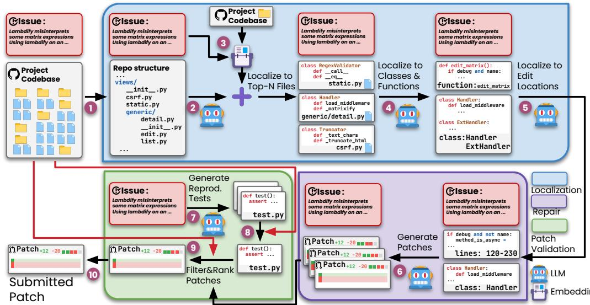
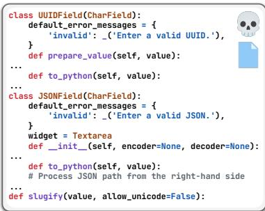
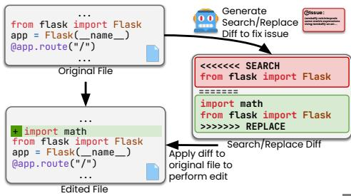
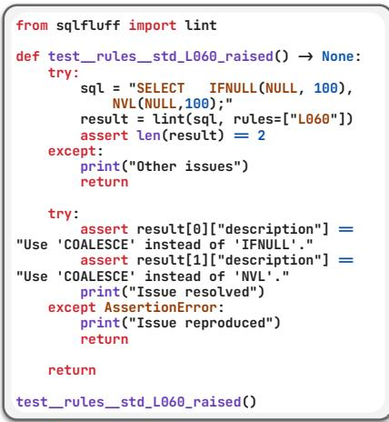
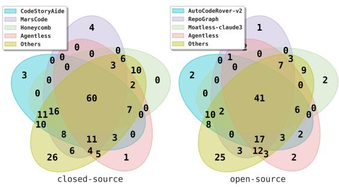
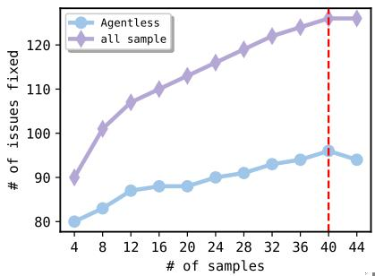
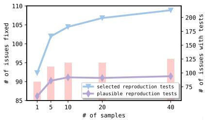
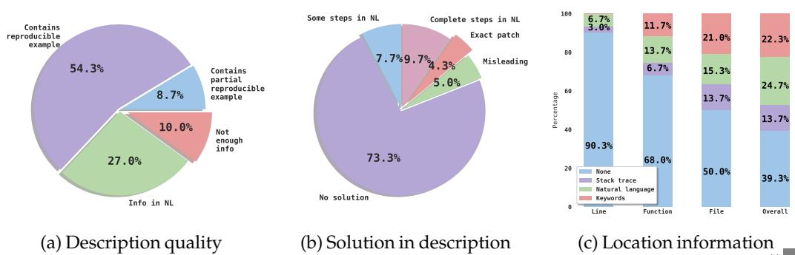
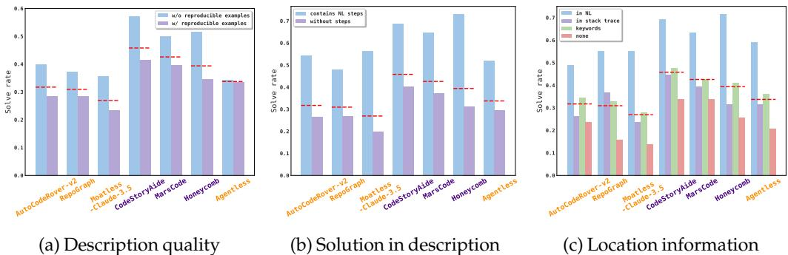

# AGENTLESS : Demystifying LLM-based Software Engineering Agents

Chunqiu Steven Xia∗ Yinlin Deng∗ Soren Dunn

Lingming Zhang

University of Illinois Urbana-Champaign

{chunqiu2, yinlind2, sorend2, lingming}@illinois.edu

# Abstract

Recent advancements in large language models (LLMs) have significantly advanced the automation of software development tasks, including code synthesis, program repair, and test generation. More recently, researchers and industry practitioners have developed various autonomous LLM agents to perform end-to-end software development tasks. These agents are equipped with the ability to use tools, run commands, observe feedback from the environment, and plan for future actions. However, the complexity of these agent-based approaches, together with the limited abilities of current LLMs, raises the following question: Do we really have to employ complex autonomous software agents? To attempt to answer this question, we build AGENTLESS – an agentless approach to automatically resolve software development issues. Compared to the verbose and complex setup of agent-based approaches, AGENTLESS employs a simplistic three-phase process of localization, repair, and patch validation, without letting the LLM decide future actions or operate with complex tools. Our results on the popular SWE-bench Lite benchmark show that surprisingly the simplistic AGENTLESS is able to achieve both the highest performance $( 3 2 . { \hat { 0 } } 0 \%$ , 96 correct fixes) and low cost $( \$ 0.70)$ compared with all existing open-source software agents! In fact, AGENTLESS has already been adopted by OpenAI as the go-to approach to showcase the real-world coding performance of both GPT-4o and the new OpenAI o1 models. Furthermore, we manually classified the problems in SWE-bench Lite and found problems with exact ground truth patches or insufficient/misleading issue descriptions. As such, we construct SWE-bench Lite-S by excluding such problematic issues to perform more rigorous evaluation and comparison. Our work highlights the currently overlooked potential of a simplistic, cost-effective technique in autonomous software development. We hope AGENTLESS will help reset the baseline, starting point, and horizon for autonomous software agents, and inspire future work along this crucial direction. We have open-sourced AGENTLESS at: https://github.com/OpenAutoCoder/Agentless

# 1 Introduction

Large language models (LLMs) have become the go-to default choice for code generation [31, 28, 53, 89]. State-of-the-art LLMs like GPT-4 [71] and Claude 3.5 Sonnet [26] have demonstrated their prowess in being able to synthesize code snippets based on given user description. However, compared to the main evaluation setting of simple, self-contained problems, applying LLMs on repository-level software engineering tasks has been understudied. Software engineering tasks like feature addition, program repair, and test generation require an in-depth understanding of not only information within files, containing thousands of lines of code, but also repository-level dependencies across files.

Recently, to address the gap and evaluate the ability of tools to automatically solve real-world software engineering problems, the popular SWE-bench [44] benchmark has been developed. In SWE-bench, each problem consists of a real-world GitHub issue description and the corresponding Python repository. The task is to modify the repository to resolve the issue, either fixing a bug or introducing a new feature. Recently, the authors have published a subset of the benchmark – SWE-bench Lite [23] (300 problems) that performs further filtering and focuses on bug fixing issues.

To solve the challenging real-world software development problems from SWE-bench, inspired by the Devin AI Software Engineer [7], there has been a significant body of work from both academia and industry focusing on developing agent-based approaches [108, 37, 101, 30, 64, 29]. While there is not a fixed definition for agent-based approaches, they generally equip LLMs with a set of tools and allow agents to iteratively and autonomously perform actions, observe feedback, and plan future steps [56]. Example tools can include the ability to open/write/create files, search for code lines, run tests, and execute shell commands. In each attempt to solve a problem, agent-based approaches will have multiple turns, where each turn consists of performing an action. Subsequent turns depend on previous actions and the feedback information the agent receives from the environment.

At first glance, agent-based approaches appear to be a natural and straightforward way to tackle software development tasks. After all, human developers also perform similar actions and use feedback to plan future steps. However, the disparity between human and current LLM abilities leads to the following limitations of agent-based approaches:

• Complex tool usage/design. To utilize tools, current agent-based approaches apply an abstraction layer between the agent and the environment. Examples are mapping real actions to API calls so that agents can use tools by outputting an API call instruction. However, such abstractions and API call specifications require careful design of input/output formats and can easily lead to incorrect or imprecise tool design/usage, especially for more complex action spaces. Given the iterative nature of agent-based approaches, where current action/plan depends on previous turns, incorrectly or imprecisely defining/using a tool can both reduce performance and incur additional cost in wasted LLM queries. Lack of control in decision planning. In addition to using tools, current agent-based approaches also delegate the decision-making process to the agents, allowing them to decide when and what action to perform. The agents decide the current action to take based on previous actions taken and the feedback provided by the environment, often with minimal checks to ensure the action taken make sense. Due to the large possible action space and feedback response, it can be extremely easy for autonomous agents to become confused and perform sub-optimal explorations. Furthermore, to solve an issue, an agent can take upwards of 30 or 40 turns, which makes it extremely difficult to both understand the decisions made by the agents and also debug the exact turns where an incorrect decision is made.   
Limited ability to self-reflect. Existing agents struggle with the capability to perform self-reflection [69, 41]. That is to say they tend to take all information/feedback and do not know how to filter out or correct irrelevant, incorrect, or misleading information [84, 107]. The limited ability to self-reflect means that an incorrect step can be easily amplified and negatively affect all future decisions made by the agent.

In this paper, we advocate that instead of rushing to develop increasingly complex LLM agent-based approaches and tools for software development (which can also be non-trivial to use or replicate due to the fully autonomous setup), we should first take a step back and ask the following introspective question: Do we really have to employ complex autonomous software agents?

Our work. We set out to answer this important question by building AGENTLESS – an agentless approach to automatically resolve software development issues. To solve each issue, AGENTLESS follows a simple three phase process: localization, repair, and patch validation. In the localization process, AGENTLESS employs a hierarchical process to first localize the fault to specific files, then to relevant classes or functions, and finally to fine-grained edit locations. AGENTLESS’s localization process make uses of both LLM-based localization as well classic information-retrieval-based localization idea [109]. To perform repair, AGENTLESS takes the localized edit locations and generates multiple candidate patches in a simple diff format. At the same time, AGENTLESS generates reproduction tests that can reproduce the original error and help with candidate patch selection. Finally, AGENTLESS re-ranks all remaining patches and selects one to submit in order to fix the issue. While AGENTLESS leverages LLMs to perform each detailed task, unlike prior complex agent-based tools, AGENTLESS does not allow LLMs to autonomously decide future actions or operate with any complex tools. Our deliberate choice to avoid using agents not only allows AGENTLESS to have a simplistic and straightforward design that is easy to understand, but also helps avoid the above-mentioned limitations of LLM agents in software development. We evaluate AGENTLESS on the popular SWE-bench Lite [23] benchmark and demonstrate that AGENTLESS not only achieves the highest performance $( 3 2 . 0 0 \% )$ among all open-source approaches, but also does so at a fraction of the cost!

Furthermore, we performed a fine-grained manual analysis on the SWE-bench Lite dataset and classified all its problems into different categories across dimensions like problem description, ground truth patch, and bug location information. Surprisingly, we observed that SWE-bench Lite contains problems with exact ground truth patch in the description $( 4 . 3 \% )$ , problems with missing critical information needed to solve the issue $( 1 0 . 0 \% ) $ , and problems that include misleading solutions in the issue description $( 5 . 0 \% )$ . Recognizing these issues, we built SWE-bench Lite-S, which removes such problematic problems, and serves as a more rigorous benchmark to evaluate the ability to solve real-world software development challenges. Overall, in an era focused on achieving top placements on leaderboards, our work highlights the overlooked potential of a simplistic, cost-effective technique in autonomous software development. We hope AGENTLESS will help reset the baseline, starting point, and horizon for autonomous software agents, and inspire future work along this crucial direction.

Contributions. In this work, we make the following contributions:

• An agentless approach. We propose AGENTLESS, an agentless approach to automatically solve software development problems. AGENTLESS leverages LLM-empowered prompting-based and embedding-based retrieval to perform hierarchical localization. During repair, AGENTLESS samples multiple candidate patches in a simple diff format for efficient patch generation. AGENTLESS then generates reproduction tests to verify that the issue has been resolved. Finally, AGENTLESS leverages both regression tests and generated reproduction tests to select the final submission patch. Extensive evaluation. We evaluate AGENTLESS on the popular SWE-bench Lite dataset comparing against state-of-the-art agent-based approaches. Our results demonstrates that AGENTLESS is able to achieve higher performance $( 3 2 . 0 0 \%$ , 96 correct fixes) than all open-source approaches, with comparably low cost as well. This shows the previously overlooked potential of a simplistic technique in autonomous software development. Additionally, AGENTLESS has already been adopted by OpenAI as the go-to approach to showcase the real-world coding performance of GPT-4o [34] as well as the new o1 model family [74] We further perform a rigorous ablation study to understand the effectiveness of different components of AGENTLESS on the final performance. SWE-bench Lite-S benchmark. We performed manual classifications on the problems in the popular SWE-bench Lite dataset. We found that there are problematic problems with unclear, misleading issue descriptions, as well as problems that contain exact ground truth patches. To address these issues, we constructed a filtered dataset of SWE-bench Lite-S that excludes such problematic issues, enabling more rigorous evaluation and comparison. This has also been confirmed recently by OpenAI, which acknowledged our benchmark and released SWE-bench Verified [34] along the same direction.

# 2 Background and Related Work

# 2.1 Agent-based Software Engineering

With the emergence and popularity of agent-based frameworks [92], recently researchers and industry practitioners have begun developing agent-based approaches to solve software engineering tasks. Devin [7] (and OpenDevin [17], open-source alternative), is one of the first end-to-end LLM agent-based framework. Devin uses agents to first perform planning based on user requirement, then allows the agent to use file editor, terminal, and web search engine tools to iteratively perform the task. SWE-agent [101] designs a custom agent-computer interface (ACI) that allows the LLM agent to interact with the repository environment with actions such as reading, editing files, and running bash commands. Aider [37] first provides a detailed repository map constructed with static and call graph analysis to the LLM to localize the files that require editing; then it generates a simple diff format as the editing patch and uses regression testing to verify if the patch is plausible. Moatless [15] is another open-source agent tool that obtains relevant code locations by providing the agent with both code search tools as well as retrieval methods using LLMconstructed queries. Similar to Aider, Moatless also generates a simple diff format as the final submitted patch. AutoCodeRover [108] further provides the LLM agent with specific code search APIs (e.g., searching methods in a certain class) to iteratively retrieve code context and locate the bug locations. SpecRover [81] later improves over AutoCodeRover and targets specifications (i.e., inferring the intended program behavior) by generating function summaries and also feedback messages during specific agent steps. Furthermore, SpecRover also attempts to generate reproduction tests to reproduce the original issue used to select the final patch. In addition to these highlighted examples, there has been a plethora of other agent-based approaches developed in both open-source [37, 19, 5, 104] and close-source/commercial products [29, 30, 64, 13, 9, 1, 16, 58, 4, 22, 20, 12, 14, 10, 2].

Compared to these agent-based techniques, AGENTLESS offers a simplistic, interpretable, and cost-effective solution to tackle real-world software engineering issues. Different from agent-based tools, AGENTLESS contains well-defined stages of localization, repair, and patch validation without letting the LLM agent decide future actions or use complex tools. AGENTLESS demonstrates for the first time that an agentless approach can achieve very competitive performance, without the additional baggage of having to provide excessive tools or model complex environment behavior/feedback.

# 2.2 Fault Localization and Program Repair

Fault localization (FL) [90] techniques aim to identify the suspicious locations (e.g., statements or methods) in source code related to bugs. Dynamic FL techniques mainly include spectrum-based FL (SBFL) [47, 25, 24] and mutation-based FL (MBFL) [77, 68, 63]. SBFL typically computes source code locations primarily covered by failing tests as more suspicious than locations primarily covered by passing tests. MBFL further improves upon that to additionally consider the impact of each source code location on the test outcomes (measured using mutation testing [76]). Besides dynamic techniques, researchers have also proposed to directly leverage information retrieval (IR) techniques [85] for static FL. Such IR-based techniques [87, 82, 88] formulate FL as a search problem and compare the textual similarity between code elements and the bug report (i.e., query). Moreover, learning-based techniques have also been proposed to leverage machine learning to combine multiple sources of dynamic/static information, including DeepFL [54], FLUCCS [86], and TRANSFER [67]. Recently, researchers have proposed LLM-based FL [98, 91, 79, 48], which leverages the powerful code and natural language understanding of modern LLMs to directly localize bugs. Meanwhile, most such LLM-based techniques either cannot perform repository-level FL due to the limited context window of LLMs [98], or rely on complicated/costly agentic design to navigate through the codebase [48, 79]. In contrast, AGENTLESS employs a simplistic hierarchical FL process (based on both LLMs and IR) to efficiently compute the fine-grained edit locations.

After localizing the bug, the next step is to perform repair. Automated program repair [38] (APR) has been widely studied to automatically generate patches for bugs. Traditional APR techniques can be categorized as template-based [57, 39], heuristic-based [51, 50], and constraint-based [65, 61] tools. While effective, traditional APR tools suffer from scalability issues and are limited by their patch variety. As such, researchers have proposed learning-based APR tools either by training NMT (neural machine translation) models [43, 55, 33, 110] or using pre-trained LLMs to perform repair [96, 94, 49, 106]. Specifically, LLM-based APR tools, which sample multiple candidate patches per bug, have been shown to be the state-of-the-art due to the powerful coding capability of modern LLMs [94]. More recently, agent-based APR techniques have also been proposed [97, 29, 40, 32, 105]. Inspired by existing LLM-based APR tools, AGENTLESS samples multiple candidate patches per issue to maximize the chance of generating a correct fix. Different from most LLM-based APR techniques, AGENTLESS generates patches using a simple diff format [37] to avoid generating the complete code and instead focus on producing cost-efficient small edits, increasing the reliability and accuracy of patch generation (less chances for hallucination). Furthermore, different from the simplistic bugs studied in most prior work [94], AGENTLESS targets complex repository-level issues spanning multiple locations.

  
Figure 1: Overview of AGENTLESS.

# 2.3 LLM-based Test Generation

In addition to localizing and repairing bugs, another research area that has been adopting LLM is test generation. One area of test generation is fuzz testing [103], also known as fuzzing, to generate large amounts of inputs in order to expose bugs in systems. Researchers have applied LLMs to perform fuzzing in domains such as DL libraries [35, 36], OS Kernel [100, 70], compilers [93, 99, 75], network protocols [66], and mobile applications [59]. LLM-based fuzzers have demonstrated their impact by detecting many bugs not found by traditional fuzzers as well as unlocking new fuzzing domains. Besides fuzzing, researchers have also proposed to leverage LLMs for unit test generation to test individual software units (e.g., methods/classes) [56], such as CodeMosa [52], ChatTester [102], TestPilot [83], and CoverUp [78].

Bug reproduction is a critical step in investigating bug reports [46], and is integrated into many recent software engineering agents [17, 81, 10, 14, 9, 101, 27]. For example, SpecRover [81] begins by generating a test to reproduce the issue described in the bug report; the test then guides the context retrieval and patching process.Unlike such agent-based approaches, which generate a reproduction test and rely on an LLM agent to decide whether the test is correct, AGENTLESS simply executes multiple sampled tests and verifies if the execution results indicate the issue has been reproduced.

# 3 AGENTLESS Approach

Figure 1 shows the overview of AGENTLESS, consisting of three phases: localization, repair, and patch validation. We first take in the issue description and the existing project codebase as input. Then, we begin our hierarchical localization process by turning the project codebase into a tree-like structure that illustrates the relative location of each file in the project $\textcircled{1}$ . Next, using this repository structure along with the original issue description, we prompt the LLM to localize and rank the top N most suspicious files that likely require editing to solve the issue $\textcircled{2}$ . Since our repository structure format does not contain detailed source code information, we additionally retrieve files with most relevant code snippets with the issue description using embedding-based retrieval $\textcircled{8}$ . We then combine the retrieved files with the LLM-localized files to obtain the final list of suspicious files. However, not all contents in each file need to be modified. As such, we provide a skeleton for each file (i.e., a list of declaration headers of the classes and functions) and ask the LLM to output a specific list of classes and functions that we should examine more closely to fix the bug $\textcircled { \circ }$ . We then provide the complete code content of the previous locations and ask the LLM to finalize a smaller set of edit locations (i.e., classes, functions, or even specific lines) $\circledcirc$ . For the repair phase, we provide the code snippets at these edit locations together with the issue description and prompt the LLM to sample multiple patches to solve the issue $\bullet$ . Next, we enter the patch validation phase, where we first ask the LLM to sample multiple reproduction tests that aim to replicate the original issue $\textcircled { 7 } .$ and then select the optimal one based on actual execution results on the original codebase $\circledcirc$ AGENTLESS uses the reproduction test along with existing regression tests for patch ranking/selection $\circledcirc$ Finally, AGENTLESS selects the top-ranked patch as the final patch for submission $\textcircled{1}$ . We now describe the steps in each of AGENTLESS’s phases in more detail.

# 3.1 Localization

To fix or implement a new feature, the first step is to obtain the locations in the source code, as without the correct locations, it can be impossible to provide the right edits. The difficulty lies in the fact that there could be hundreds of files with thousands of lines of code each in a repository, whereas the correct locations to edit are only a few selected lines or functions. AGENTLESS addresses this by using a simple three-step hierarchical localization process: 1) localize to suspicious files; 2) localize each selected files into relevant classes, functions, and variables; 3) localize to code edit locations.

# 3.1.1 Localize to suspicious files.

First, AGENTLESS narrows down potential locations to specific suspicious files. Instead of providing the complete code snippet for each file, AGENTLESS constructs a concise representation of the repository’s file and directory structure, similar to the Linux tree command. We refer to this as the repository structure format, which begins with the root folder of the repository and organizes code files or folder names. Files and folders at the same directory level are aligned vertically, and files/folders in sub-directories are indented. We recursively traverse the entire repository to obtain the structure, which will be used as input for the LLM. The repository structure format provides the necessary file paths alongside the neighboring file names to maintain organizational information in the original codebase. AGENTLESS then inputs the processed repository structure along with the original issue description to an LLM, and requests it to identify a list of the top N suspicious files that need further inspection or modification to resolve the issue.

To compliment the prompting-based localization (using file names only), AGENTLESS also uses a simple embedding-based retrieval method to identify additional suspicious files. However, instead of embedding all files in the repository, AGENTLESS first filters out irrelevant folders. This is done by providing the previously described repository structure and asking the LLM to produce a list of irrelevant folders that do not need to be further inspected or modified to resolve the issue. After removing all files from these irrelevant folders, AGENTLESS divides each remaining file into chunks of code segments and computes the embedding for each chunk using an embedding model. AGENTLESS then embeds the original issue description (i.e., the query) and computes the cosine similarity between the resulting query embedding and each chunk embedding to retrieve a list of relevant files that contain code segments with the highest similarity to the query. Finally, AGENTLESS combines the files obtained via prompting with those retrieved via embedding by selecting top N most common files localized by both, resulting in a final list of relevant files.

# 3.1.2 Localize to related elements.

After obtaining the list of suspicious files, AGENTLESS proceeds to the second part of the localization process: localize the related elements within these files. Directly providing the complete context of all files can be large. As such, AGENTLESS builds a compressed format of each file that contains the list of class, function, or variable declarations. We refer to this format as the skeleton format, with an example shown in Figure 2. In the skeleton format, we provide only the headers of the classes and functions in the file. For classes, we further include any class fields and methods (signatures only). Additionally, we also keep comments in the class and module level to provide further information. Compared to providing the entire file context to the model, the skeleton format is a much more concise representation, especially when the file contains thousands of lines, making it impractical/- costly to process all at once with existing LLMs. We provide the skeleton of all suspicious files to the LLM at one time in a single prompt, enabling the model to comprehensively analyze the pertinent information and decide the most relevant elements. Using this input, we prompt the LLM to provide a list of related classes and functions that one should examine to fix the provided issue.

  
Figure 2: File skeleton format.

# 3.1.3 Localize to edit locations.

The previous localization step provided us with a list of related code elements; since we localize top N suspicious files, these localized related code elements could be from different files. We now directly provide the code content from these elements to the LLM and ask it to localize specific edit locations. Compared to using the entire file, the input context here is much smaller. With this input, we then ask the LLM to identify the final set of edit locations, specified by line numbers, functions, or classes. Our simple hierarchical localization allows AGENTLESS to select a set of relevant code snippets as edit locations for repair.

  
Figure 3: Search/Replace edit format.

# 3.2 Repair

In the repair stage, the goal is to produce the correct patch to solve the issue. Following existing work on LLM-based program repair [96, 49, 95, 42], we first utilize the identified edit locations and construct a context window of code snippets to provide to the LLM for repair. For example, if the identified location was a class from line 40 to 78, we would produce a context window of $[ 4 0 \texttt { - x }$ , $7 8 + \tt { x } ]$ where $\mathtt { x }$ denotes the context window size. The intuition behind adding the additional code before and after the identified location is to provide the LLM with relevant contextual information for better program repair [96]. If multiple edit locations are identified, we would concatenate these context windows together separated with “...” to indicate missing context in the middle.

Using the code snippets, we then ask the LLM to generate patches to solve the issue. However, instead of directly producing the entire code snippet to replace the entire given context, AGENTLESS asks the LLM to generate a Search/Replace edit [37]: a simple diff format to efficiently create each patch. Figure 3 shows an example of the Search/Replace format containing two main parts: 1) search: the original code snippet we want to replace and 2) replace: the replacement code snippet we want to replace with. To apply the generated

Search/Replace diff to the original file, we can simply match the search code snippet and replace it with the replacement. This simple diff format avoids generating the complete code and instead focuses on producing small edits, which are not only more cost-efficient, but also more reliable and accurate (less chances for hallucination). For each issue, AGENTLESS uses the LLM to generate multiple potential patches (starting with greedy and then sample multiple patches with higher temperature).

# 3.3 Patch Validation

# 3.3.1 Reproduction test generation.

Since AGENTLESS generates multiple candidate patches per issue, we need a way to select a final patch for submission. Please note that under the realistic SWE-bench setup, the original project codebase can only provide regression tests and not any reproduction tests (i.e., bug-triggering tests). This is because the issue has just been raised and the developers have not added any additional tests to trigger the issue. As such, different from the Generate-andValidate program repair setup [62], we do not have access to bug-triggering tests.

Following prior work [81, 30], AGENTLESS generates additional reproduction test to help with patch selection. More specifically, AGENTLESS leverages the LLM to synthesize a complete testing file that attempts to both reproduce the original issue described in the issue description, as well as verify whether the issue has been fixed. Figure 4 shows an example of the reproduction test that we want the model to synthesize. If the issue is reproduced, the test outcome should print Issue reproduced. On the other hand, the test should output Issue resolved if the issue has been fixed. We also include another output of Other issues if the test runs into any unexpected issues. To generate the reproduction test, AGENTLESS provides the original issue description with an example reproduction test to demonstrate the test format. Similar to repair, we also sample multiple candidate reproduction tests and then execute each test on the original repository to filter any tests that do not output Issue reproduced. Finally, we normalize each test (remove comments, extra spaces, and normalize test names) and then select the test with the highest number of occurrence as the final reproduction test for each issue.

  
Figure 4: Example reproduction test.

# 3.3.2 Patch selection.

Using the generated reproduction tests, we start our patch selection process to pick the final submission patch. AGENTLESS first runs all the existing tests in the repository to identify a set of passing tests that successfully pass in the original codebase. However, not all of those passing tests should be considered as regression tests since solving the issue may require changing some of the existing functionalities. Therefore, AGENTLESS provides the list of passing tests to the LLM and ask it to identify any tests that should not be ran to check if the issue has been correctly fixed (i.e., the tests that may be updated/patched during issue fixing). After removing the LLM-identified non-regression tests, we obtain a final set of regression tests. We then run the set of regression tests on all the generated patches. AGENTLESS then keeps the patches with the lowest number of regression failures. For those patches, AGENTLESS then runs the selected reproduction test and only keeps patches that output Issue resolved. Meanwhile, because the reproduction test is generated by the LLM and can potentially be incorrect/imprecise, it could be possible that no patch can pass the reproduction test; in that case, AGENTLESS will fall back on only using the regression test results for selection. AGENTLESS then applies a re-ranking approach using majority voting:

We first normalize each patch to ignore surface-level differences (e.g., extra spaces, newlines, and comments), and then select the patch with the highest number of occurrences as the final patch for submission. More specifically, to standardize the patch, we begin by parsing both the old and new code (after applying the patch) into abstract syntax trees. Next, we unparse the trees into a canonical source code format with docstrings removed. Finally, we compute the textual diff between the standardized old and new code to get the normalized patch.

AGENTLESS solves repository-level issues using a simple step-by-step procedure. We note here that none of the techniques used by AGENTLESS in isolation are revolutionary, but instead AGENTLESS smartly combines existing techniques to construct an easy-to-understand approach. Different from prior autonomous agent-based tools that involve complex interactions with the environment, AGENTLESS uses a simplistic three-phase approach to localize, repair, and validate without relying on any agents for decision-making. By conducting localization in a hierarchical manner, AGENTLESS can efficiently and effectively compute the fine-grained locations for editing. AGENTLESS then performs repair by sampling multiple patches using a simple diff format. AGENTLESS’s patch validation approach can further aid the patch selection process by producing reproduction tests that can help verify if the issue is fixed.

# 4 Experimental Setup

Datasets. We evaluate AGENTLESS and baselines using the popular SWE-bench dataset [44] to test the ability to solve real-world software engineering issues. Each problem in SWEbench requires submitting a patch to solve the underlying issue described in the input issue description. In particular, we focus on the widely used SWE-bench Lite version [23], containing 300 self-contained problems with better quality. Furthermore, we also conduct a detailed study (Section 6.1) on the SWE-bench Lite benchmark to not only demonstrate potential issues and biases, but also produce a more rigorous filtered set of problems for better evaluation.

Implementation. We implement AGENTLESS using GPT-4o (gpt-4o-2024-05-13) [72]. By default, we query the LLM with greedy decoding. During sampling, we use a sampling temperature of 0.8. For the embedding-based retrieval method, we implement our approach using LlamaIndex [60]. We use OpenAI’s text-embedding-3-small [73] model to compute the embedding with chunk size of 512 and chunk overlap of 0. For each issue, we first localize to the top three suspicious files, and then localize to an unrestricted number of suspicious classes and functions within these files, all using greedy decoding. Next, to maximize the chances of finding the correct edit locations, we draw four samples of edit locations per issue (i.e., the third step in the localization phase). This gives us 4 separate sets of edit locations per issue. For each set, we adopt a context window of $\pm 1 0$ lines around each edit location, and generate 10 patches (1 greedy and 9 samples). This results in a total of 40 patches per bug. We adopt the same Search/Replace edit format from prior work [37], and use the built-in Python ast library [18] to perform parsing in our normalization step. To generate the reproduction tests, we also generate 40 samples (1 greedy and 39 samples) in total prior to patch selection (described in Section 3.3.1). The regression tests are obtained by first running all the tests to obtain a set of passing tests that successfully pass in the original repository and then use the LLM to identify any non-regression tests (described in Section 3.3.2). We do not directly use the provided list of regression tests already identified in the PASS TO PASS field of SWE-bench as requested by the SWE-bench maintainers1. We modify the official SWE-bench evaluation setup to be able to freely execute arbitrary regression and reproduction tests.

Baselines. We compare AGENTLESS against 26 agent-based approaches. These baseline tools represent the state-of-the-art performance on SWE-bench. We include state-of-the-art open-source as well as commercial or closed-source baselines (indicated via a ). We note here that the majority of the closed-source baselines do not provide any trajectories, just the submission patches. Therefore, we cannot verify the steps taken to arrive at the final patches. Moreover, we also include a simple agentless baseline using retrieval-augmented generation (RAG) proposed as part of SWE-bench [44] for comparison. In this case, the agentless baseline uses the LLM to directly generate a patch file by providing it with the file content of the most relevant files, retrieved using BM25 [80].

Metrics. Following prior work [108], we report 1) $\%$ Resolved: the percentage of resolved problems in the benchmark, 2) Avg. $\$ 9$ Cost: average inference cost of running the tool, and 3) Avg. # Tokens: average number of input and output tokens used to query to LLM. Additionally, we also report the $\%$ Correct Location: the percent of problems where the patch produced by the tool covers the edit location(s) of the ground truth developer patch. We compute this metric over three granularities: file, function, and line. We report that a patch contains the correct location if it edits a superset of all locations in the ground truth patch. For baseline tools, we directly use the reported results either from the official leaderboard [45] or from the tool’s official paper/repository.

# 5 Evaluation

Table 1: Results on SWE-bench Lite. Note: indicates approaches that are closed-source (i.e., source code is not released). indicates approaches built on top of an earlier version of our AGENTLESS. '-' indicates that the relevant information to compute this has not been released. $\ ?$ indicates that multiple models are used, but some of them are not specified. Claude 3.5 S is short for Claude 3.5 Sonnet.

<table><tr><td>Tool</td><td>LLM</td><td>% Resolved</td><td></td><td># o es</td><td> e</td><td></td></tr><tr><td>CodeStory Aide [2] </td><td>GPT-4o+A Claude 3.5 S</td><td>129 (43.00%)</td><td></td><td></td><td>41.7% 58.7%</td><td>72.0%</td></tr><tr><td>Bytedance MarsCode [58] </td><td>NA</td><td>118 (39.33%)</td><td></td><td>42.7%</td><td>58.0%</td><td>79.7%</td></tr><tr><td>Honeycomb [10]</td><td>NA</td><td>115 (38.33%)</td><td></td><td>44.3%</td><td>57.0%</td><td>69.3%</td></tr><tr><td>MentatBot [14] </td><td>GPT-4o</td><td>114 (38.00%)</td><td></td><td>37.3%</td><td>53.3%</td><td>69.3%</td></tr><tr><td>Gru [20]</td><td>NA</td><td>107 (35.67%)</td><td></td><td>38.3%</td><td>54.3%</td><td>75.0%</td></tr><tr><td>Isoform</td><td>NA</td><td>105 (35.00%)</td><td></td><td>41,963 38.7%</td><td>55.3%</td><td>72.0%</td></tr><tr><td>SuperCoder2.0 [22]</td><td>NA</td><td>102 (34.00%)</td><td></td><td>41.7%</td><td>63.7%</td><td>65.7%</td></tr><tr><td>Alibaba Lingma Agent [13] </td><td>GPT-4o+A Claude 3.5 S</td><td>99 (33.00%)</td><td></td><td>40.0%</td><td>58.7%</td><td>75.0%</td></tr><tr><td>Factory Code Droid [9] </td><td>NA</td><td>94 (31.33%)</td><td></td><td>36.7%</td><td>55.7%</td><td>72.7%</td></tr><tr><td>Amazon Q Developer-v2 [4] </td><td>NA</td><td>89 (29.67%)</td><td></td><td>40.3%</td><td>52.0%</td><td>74.3%</td></tr><tr><td>SpecRover [81] </td><td>GPT-4o+A Claude 3.5 S</td><td>93 (31.00%)</td><td>$0.65</td><td></td><td></td><td></td></tr><tr><td>CodeR [30]:</td><td>GPT-4</td><td>85 (28.33%)</td><td>$3.34  323,802 35.7%</td><td></td><td>52.3%</td><td>67.0%</td></tr><tr><td>MASAI [27]</td><td>NA</td><td>84 (28.00%)</td><td></td><td>38.7%</td><td>56.3%</td><td>75.0%</td></tr><tr><td>SIMA [3]</td><td>GPT-40</td><td>83 (27.67%)</td><td>$0.82</td><td>37.0%</td><td>54.0%</td><td>79.0%</td></tr><tr><td>IBM Research Agent-101 [1] </td><td>NA</td><td>80 (26.67%)</td><td></td><td>39.7%</td><td>56.7%</td><td>73.3%</td></tr><tr><td>OpenCSG StarShip [16]</td><td>GPT-4</td><td>71 (23.67%)</td><td></td><td>39.0%</td><td>61.7%</td><td>90.7%</td></tr><tr><td>Amazon Q Developer [4] </td><td>NA</td><td>61 (20.33%)</td><td></td><td>34.0%</td><td>43.7%</td><td>71.7%</td></tr><tr><td>RepoUnderstander [64] </td><td>GPT-4</td><td>64 (21.33%)</td><td></td><td></td><td></td><td></td></tr><tr><td>AutoCodeRover-v2 [6]</td><td>GPT-40</td><td>92 (30.67%)</td><td></td><td></td><td>35.0%</td><td>52.3% 69.3%</td></tr><tr><td>RepoGraph [19]</td><td>GPT-40</td><td>89 (29.67%)</td><td></td><td>36.7%</td><td>51.3%</td><td>71.0%</td></tr><tr><td>Moatless [15]</td><td>AClaude 3.5 S</td><td>80 (26.67%)</td><td>$0.17</td><td>38.7%</td><td>54.7%</td><td>78.7%</td></tr><tr><td>OpenDevin+CodeAct v1.8 [17]</td><td>GPT-40</td><td>74 (24.67%)</td><td>$0.14</td><td>36.0%</td><td>52.0%</td><td>73.0%</td></tr><tr><td>Aider [37]</td><td>A Claude 3.5 S</td><td>80 (26.67%)</td><td>$1.14</td><td>38.0%</td><td>49.7%</td><td>67.3%</td></tr><tr><td>SWE-agent [101]</td><td>GPT-4o+A Claude 3.5 S</td><td>79 (26.33%) 69 (23.00%)</td><td></td><td>35.3%</td><td>50.0%</td><td>69.7%</td></tr><tr><td></td><td>A Claude 3.5 S GPT-40</td><td>55 (18.33%)</td><td>$1.62</td><td>521,208 40.7%</td><td></td><td>54.3% 72.0%</td></tr><tr><td></td><td>GPT-4</td><td>54 (18.00%)</td><td>$2.53 $2.51</td><td>498,346 29.3%</td><td>42.3%</td><td>58.3%</td></tr><tr><td>AppMap Navie [5]</td><td>GPT-40</td><td>65 (21.67%)</td><td></td><td>245,008 30.7% 29.7%</td><td>45.3% 44.7%</td><td>61.0%</td></tr><tr><td>AutoCodeRover [108]</td><td>GPT-4</td><td>57 (19.00%)</td><td>$0.45</td><td>38,663</td><td>29.0%</td><td>59.7% 42.3% 62.3%</td></tr><tr><td>RAG [101]</td><td>A Claude 3 Opus</td><td></td><td></td><td></td><td></td><td></td></tr><tr><td rowspan="4"></td><td>GPT-4</td><td>13 (4.33%)</td><td>$0.25</td><td>22.0%</td><td>30.0%</td><td>57.0%</td></tr><tr><td></td><td>8 (2.67%)</td><td>$0.13</td><td></td><td>12.7%</td><td>23.3% 47.3%</td></tr><tr><td>AClaude-2</td><td>9 (3.00%)</td><td></td><td>16.7%</td><td>24.3%</td><td>46.7%</td></tr><tr><td>GPT-3.5</td><td>1 (0.33%)</td><td></td><td></td><td>6.3%</td><td>11.3% 27.3%</td></tr><tr><td>AGENTLESS</td><td>GPT-4o</td><td>96 (32.00%)</td><td>$0.70</td><td>78,166</td><td>35.3%</td><td>52.0% 69.7%</td></tr></table>

# 5.1 Performance on SWE-bench Lite

Table 1 shows the main evaluation result of AGENTLESS and prior agent-based approaches on SWE-bench Lite. We observe that AGENTLESS is able to solve 96 out of 300 problems $( 3 2 . 0 0 \% )$ ). While this is not the highest percentage of problems solved on SWE-bench Lite, AGENTLESS is extremely competitive compared with prior agent-based approaches while using a much simpler design and overall technique. It is important to note here that many of the top techniques are closed-source/commercial and did not release any source code to reproduce experiments or even trajectories for further verification. Compared with all open-source approaches, AGENTLESS is able to achieve the highest performance of $3 2 . 0 0 \%$ (96 / 300) on SWE-bench Lite. Additionally, AGENTLESS only costs on average $\$ 0.70$ , which is less than most prior agent-based approaches. Comparing against the RAG agentless baselines, we see that while AGENTLESS costs slightly more, AGENTLESS is also able to fix way more issues.

# 5.1.1 Unique issues fixed.

Figure 5 shows the unique issues solved by AGENTLESS compared with the top-performing closed-source / commercial and open-source approaches (“Others” indicates all other approaches within each category). First, we see that compared to the open-source agent-based tools, AGENTLESS is able to fix 2 issues that no other tools can resolve, showing the success of using a simple agentless approach in solving difficult issues. Furthermore, even when compared with high-performing commercial approaches, AGENTLESS is still able to offer a unique fix. This low number of unique fixes can be attributed to the

  
Figure 5: Venn diagram for issue fixes.

fact there are already tools built on top of earlier versions of AGENTLESS (e.g., Isoform [12]) or partly inspired by AGENTLESS (e.g., Bytedance MarsCode [58]), thereby reducing the unique issues resolved by AGENTLESS. Nevertheless, our results show that AGENTLESS can be competitive/complementary compared to existing agents.

# 5.1.2 Localization performance.

In real-world software development, apart from directly fixing the issue, providing the correct edit location to developers is extremely helpful for debugging. As such, we examine the locations of the patches generated by each technique compared with the ground truth patch. We note here that it is possible to fix a bug in a different location than the ground truth, however comparing against the ground truth patch can still serve as an approximate measure. Table 1 additionally shows the percentage of submitted patches with correct locations for each tool, across line, function, and file levels. We first observe that the percentage of patches with correct locations correlates heavily with the solve rate. Interestingly, the highest result for file-level location is OpenCSG StarShip at $9 0 . 0 \%$ , significantly higher than even the best-performing approaches while at the same time having a relatively low solve rate $( 2 3 . 6 7 \% )$ . As OpenCSG StarShip is a commercial product that does not provide source code or detailed trajectories, it is difficult to explain this huge difference between localization and repair performance. In terms of localization performance, by using our simple hierarchical approach, AGENTLESS remains very competitive compared with previous agent-based approaches.

# 5.1.3 Reproduction test results.

AGENTLESS uses regression and generated reproduction tests to perform filtering in order to select the final submission patch. Therefore, we evaluate the quality of our generated reproduction tests. We note here that as described in Section 3.3.1, we only use the generated reproduction test if it can successfully reproduce the original issue in the original repository. Out of the 300 problems in SWE-bench Lite, AGENTLESS is able to produce 213 reproduction tests that output the required reproduction message when evaluated on the original repository. However, these tests might still be incorrect as a correct reproduction should also be able to verify that the issue has been correctly resolved. To evaluate this, we directly apply the ground truth patch provided in SWE-bench2. We found that only 94 tests correctly output the Issues resolved message after applying the ground truth patches. This steep drop-off can be partially explained as sometimes the issue description provided in the problem may not contain enough information to generate complete test cases for validating a correct solution. However, this problem is partially mitigated as AGENTLESS takes a conservative approach of requiring all patches to pass the regression test suite first and will remove a patch if it cannot pass the regression tests but passes on the generated reproduction test. This reduces the likelihood of an incorrect reproduction test selecting a correct patch. Furthermore, if all generated patches cannot pass the reproduction test, AGENTLESS will fall back on only using the regression test results for selection. In Section 5.2.3 we closely examine the impact of using both regression and reproduction test for patch selection has on the performance.

# 5.1.4 Adoption of AGENTLESS.

Although released very recently, AGENTLESS has already received widespread adoption. In Table 1, there are two baseline tools (indicated via ) already built upon earlier versions of our AGENTLESS: RepoGraph [19] is an open-source tool combining AGENTLESS with repository-level graph, while Isoform [12] is a closedsource commercial tool also built upon AGENTLESS. Additionally, Bytedance MarsCode [58] is partly inspired by AGENTLESS in patch sampling/selection and OpenDevin [17] is in the process of integrating AGENTLESS into their ecosystem. Furthermore, AGENTLESS has also been adopted by OpenAI as the default approach when showcasing the real-world coding performance of GPT-4o on their new SWE-bench Verified benchmark [34], where AGENTLESS also achieves the

Table 2: Performance of different localization steps.   

<table><tr><td>Method</td><td>Contains GT</td><td></td><td>LoC Avg.$</td></tr><tr><td colspan="2">File level localization</td><td></td><td></td></tr><tr><td>Prompting-based</td><td>78.67% 3,221</td><td></td><td>$0.02</td></tr><tr><td>Emeiin-basiterng</td><td></td><td>67.67%3,388</td><td>$0.05</td></tr><tr><td></td><td>70.33%</td><td>3,622</td><td>$0.04</td></tr><tr><td>Combined</td><td>81.67%</td><td>3,424</td><td>$0.06</td></tr><tr><td colspan="2">Related element localization</td><td></td><td></td></tr><tr><td>Complete file</td><td>53.67%</td><td>778</td><td>$0.15</td></tr><tr><td>Skeleton format</td><td>58.33%</td><td>698</td><td>$0.02</td></tr><tr><td colspan="2">Edit location localization</td><td></td><td></td></tr><tr><td>Greedy</td><td>50.67%</td><td>189</td><td>$0.06</td></tr><tr><td>Direct from file-level</td><td>47.00%</td><td>208</td><td>$0.18</td></tr><tr><td>Multi-samples merged</td><td>56.33%</td><td>342</td><td>$0.07</td></tr><tr><td rowspan="3">Multi-samples</td><td>49.67%</td><td>165</td><td rowspan="3">$0.07</td></tr><tr><td></td><td></td></tr><tr><td>49.33%</td><td>160</td></tr><tr><td></td><td>48.33%</td><td>213</td><td></td></tr></table>

best performance compared with all other studied agent-based solutions. At the time of finishing up this draft, OpenAI just released the new o1 model family and also adopted AGENTLESS as the top/default approach to showcase their performance on SWE-bench [74].

# 5.2 Ablation study on components of AGENTLESS

Next, we look at how each component in the localization, repair, and patch validation phases contributed to the final AGENTLESS performance. Unless otherwise specified, we vary the configuration of one component while using the default parameters for all other settings.

# 5.2.1 Localization ablation.

Table 2 shows the performance and cost for each of the 3 steps in AGENTLESS’s localization phase. We show after each localization step the percentage of problems whose ground truth edit locations remain in the location set (“Contains $\mathrm { G T ^ { \prime \prime } }$ ), the average lines of code of each location set $( ^ { \prime \prime } \mathrm { L o C ^ { \prime \prime } } ) .$ , and the average dollar cost of each step $( ^ { \prime \prime } \mathrm { A v g } \bar { \bf g } . \bar { \bf g } ^ { \prime \prime } )$ . The bold method indicates the default setting of AGENTLESS. First, we examine the different configurations of file level localization. To start with, for the retrieval method based on embeddings, we see that without including the irrelevant folder filtering to remove irrelevant folders for embedding (described in Section 3.1.1), both the performance and cost become worse. This demonstrates the importance of limiting the number of files to consider during embedding and focusing on essential parts of the repository for more cost-efficient and effective localization. We see that using the prompting-based or the embedding-based retrieval method alone can locate the ground truth file in $7 8 . 7 \%$ and $6 7 . 7 \%$ of cases respectively. This can be further improved by combining them to obtain $8 1 . 7 \%$ correct file localization, showing that prompting-based and embedding-based retrieval methods can complement each other in identifying different sets of relevant files.

Using all of the localized files leads to a large context window $( > 3 0 0 0 )$ . As such, in our second localization step, we localize to the relevant classes and functions, and are able to drastically reduce the context window $( < 8 0 0 )$ . We compare our input of using skeleton format (described in Section 3.1.2) to provide a more concise representation with the baseline of using the complete file content. We observe that by using

Table 3: Performance of different repair setups.   

<table><tr><td>Method</td><td>Performance</td><td>Avg.$</td></tr><tr><td>Greedy location (40 samples)</td><td>88 (29.33%)</td><td>$0.22</td></tr><tr><td></td><td>85 (28.33%)</td><td>$0.24</td></tr><tr><td>Mxfi-samples</td><td>96 (32.00%)</td><td>$0.29</td></tr></table>

the complete file content, not only is the cost much higher but also the number of localized groundtruth issues is reduced. The reason is most likely that LLMs cannot handle long context very well, so providing the entire file contents can confuse the model. Conversely, by using a more concise representation as the input, we can effectively localize the correct related locations that are needed for inspection and editing.

Next, AGENTLESS localizes to the exact edit locations needed to achieve even more context reduction without losing much of the localization accuracy. We compare the different ways we can perform the edit location localization: 1) “Greedy”: using greedy decoding to obtain one set of edit locations, 2) “Direct from file-level”: directly go from file-level localization to the edit locations (instead the default of localizing from file-level to related elements and then to edit locations), 3) “Multi-samples merged”: sample multiple sets of edit locations and merging them into one set, and 4) “Multi-samples”: sample multiple sets of edit locations. We first observe that by directly going from file-level to the edit locations, both the cost and performance are worse. The reason is that the model can become confused when providing a large context, demonstrating the importance of our hierarchical localization design. We also find that when merging multiple samples together, the amount of ground truth localized is higher but at the expense of having to add more context as the input during the repair phase. Our default settings also sample the edit locations multiple times, however instead of merging, we perform repair on them separately to make use of the fact each sampled location set can provide similar localization performance while also limiting the input context. In short, by using hierarchical localization steps, AGENTLESS can successfully minimize the cost while performing effective localization.

# 5.2.2 Repair ablation.

We now look at the impact of our different repair setups on the final performance. Table 3 shows the different settings and inputs for our repair phase with their performance and cost.Starting with using the greedy location set generated in the edit location generation stage, we observe that we can already achieve very high performance of more than 88 issues fixed. Similarly, for the “Multi-samples merged” where we merged multiple location sets into one, we can also achieve comparable performance. The performance can be further improved by considering each sampled locations separately (to generate 10 candidate patches each) when performing repair to achieve 96 fixes. The reason is that each different location sets may localize different ground truth locations and provide different context that can be helpful to fix specific issues. By using different edit locations and combining with our extensive test filtering and selection stage, AGENTLESS can drastically improve the repair performance.

Next, we examine the impact of using different numbers of sampled candidate patches on the performance of AGENTLESS. Figure 6 shows the number of issues fixed as we increase the number of samples. Note that the sample interval increases by 4 since we use 4 different sets of locations as input. First, we see that by just using 1 greedy sample for each location set, AGENTLESS can already achieve a significant number of correct fixes of 80. We can continue to improve repair performance by adding more samples. However, we observe that the performance plateaus at around 40 samples where adding additional candidate patches does not improve performance. This is because we perform majority voting after test filtering to select the final submission patch, which means that later samples may be ignored since it is difficult for them to offset the majoritively voted patch. Interestingly, we can also see from the figure that if we consider all patch samples (instead of only selecting one patch) for each issue, the total number of possible issues that AGENTLESS can solve is 126 $( \check { 4 } 2 . 0 \% )$ . This shows a high upper bound for the potential of AGENTLESS with future work being even better patch re-ranking and selection techniques to further improve the overall performance.

  
Figure 6: Repair performance as the number of patch samples increases.

# 5.2.3 Patch validation ablation.

Finally, we examine the impact of our different test generation and patch selection configurations has on performance. Table 4 shows the result and additional cost of different approaches. We see that by only using majority voting, we can already achieve 77 correct fixes. By adding the existing regression tests, and filter for candidate patches with the lowest amount of regression errors, we can improve performance to 81 issues resolved. Furthermore, the most significant performance improvement was achieved by incorporating additional filtering based on the generated reproduction tests, resulting in the final AGENTLESS performance of 96 fixes. This demonstrates the impact of our patch selection approach, specifically our reproduction test generation, which is able to make use of the high number of candidate patches generated and filter for the correct patch for final submission. However, using reproduction tests also comes with additional costs as AGENTLESS needs to generate these tests which are not provided in the original project repository.

Table 4: Performance of different patch selection.   

<table><tr><td>Method</td><td>Performance</td><td>Avg.$</td></tr><tr><td>Majority voting</td><td>77 (25.67%)</td><td>$0.00</td></tr><tr><td>+Regression test</td><td>81 (27.00%)</td><td>$0.01</td></tr><tr><td>+Reproduction test</td><td>96 (32.00%)</td><td>$0.25</td></tr></table>

Next, we look at our reproduction test generation strategy. Figure 7 shows the repair performance (bar, left axis), the total number of selected and plausible reproduction tests (lines, right axis) as we increase the number of candidate reproduction tests generated per issue. Recall that we only select the reproduction test if it can successfully output the Issue reproduced message when evaluated on the original repository. We further consider a selected reproduction test as plausible if it can successfully verify that the ground truth developer patch has fixed the original issue (i.e., output Issue resolved). To begin with, when we only generate one reproduction test (i.e., using the greedy output) per issue, we only produce 100 selected tests for all 300 issues in SWE-bench Lite with the repair performance being 90. We can increase the number of selected reproduction tests by increasing the number of candidate reproduction tests we generate. However, it is interesting to note that the number of plausible reproduction tests does not increase drastically (apart from going from 1 to 5 samples). The reason again is due to some ambiguity in the issue description where it may not contain sufficient information to reproduce and verify the issue has been resolved. Nevertheless, we observe a small improvement in the number of issues resolved, reaching final performance of 96 correct fixes as we increase the number of candidate reproduction tests to 40 per issue.

  
Figure 7: Reproduction test and repair results as number of samples increases.

# 6 Additional Analysis on SWE-bench Lite

6.1 Problem Classification

  
Figure 8: Categorization and corresponding breakdown of the SWE-bench Lite problems.

We now take a closer look at the problems in SWE-bench Lite. We first classify the existing problems to gain better understanding and additional insights on exactly what types of problems AGENTLESS and prior approaches can solve. Specifically, we perform manual classification based on the issue description and ground truth developer patch of each problem. Below describes each of classification dimensions and their categories in more detail:

1) Description quality. We first inspect whether each issue description contains sufficient information to perform the desired task. Figure 8a shows the distribution of each category: (i) contains enough information in natural language, (ii) contains reproducible failure example, (iii) contains partially reproducible example, and (iv) does not contain enough information.We observe that while a majority of the tasks in SWE-bench Lite contains sufficient information, with many having some small failure examples to showcase the bug, there is a non-trivial percentage $( 1 0 . \mathrm { \overset { \sim } { 0 } \% } )$ of problems which do not contain enough information. Such problems include those that require implementing a new function with a specific name or adding an error message with a specific string that was not provided in the problem description.3 This means the test will fail if the function name or error message string does not match exactly, even if the underlying functionality is correctly implemented. Another example of insufficient information are problems that have multiple different interpretations on how to solve the issue, and only a subset of them can pass the ground truth test. For instance, the issue description will outline two possible solutions suggestions with only one of them aligned well with developer intention. Implementing the other proposed solution suggestion will lead to test failure. This highlights the necessity to further sanitize/improve SWE-bench Lite where these problems with uninformative descriptions shall be further excluded.

2) Solution in description. We also examine whether the solution or steps to solve the problem are already provided in the issue description. Figure 8b shows the breakdown of our categories: (i) no solution or steps provided, (ii) partial solution provided (e.g., some steps in natural language), (iii) complete solution provided (e.g., complete steps in natural language), (iv) exact patch provided, and $( v )$ misleading solution or steps. Interestingly, we observe that $4 . 3 \%$ of issues contain the exact ground truth patch in the issue description, while an additional $9 . 7 \%$ of issues describe the exact steps required to come up with the correct solution. This shows that certain problems in SWE-bench Lite can be much easier to solve since they provide the solution either in exact code snippets or natural language. Furthermore, we also observe $5 . 0 \%$ of issues contain proposed solution or steps in the issue description that do not reflect the ground truth patch introduced by the developers. This further highlights potential issues with the benchmark, as these discrepancies can mislead tools to generate incorrect solutions simply by following the issue description.

3) Location information. We further check if the issues description contains the correct location information. We divide the granularity into line, function, and file level. Our categories are: $( i )$ exact locations in natural language, (ii) exact locations provided in failure stack traces, iii) related keywords in the issue description that can be used to search for the location, and (iv) not provided. We first observe that only in very few cases $( < 1 0 \% )$ , the issue provides the exact lines needed to fix the bug. However, this number increases as we increase the granularity to functions and files where we found that around half of the issues already provide the location of the file needed to be edited in the description. To repair a bug or introduce a new feature, finding the location to make the edit is extremely important. As such, we leverage this classification and focus our later analysis on the effect the provided location has on the repair performance of AGENTLESS and baseline approaches.

These classification dimensions and categories raise potential issues with the SWE-bench Lite problems such as unsolvable questions, misleading potential solutions, and significant differences in problem difficulties. These issues have not been properly considered by either the benchmark creation process or prior approaches. Furthermore, we hope our classification can provide additional insights on the type of problems that can be solved by existing and future approaches.

# 6.2 SWE-bench Lite-S

Building on the above problem classifications, we will more rigorously compare and contrast AGENTLESS and existing work. Specifically, we focus on a subset of the problems in SWE-bench Lite after removing the problems that contain the exact patch in the problem description, misleading solutions, or do not provide enough information in the original issue description. This eliminates the less reasonable problems and normalizes the difficulty level of the benchmark. We refer to our subset of 249 problems as SWE-bench Lite-S. We note here that our approach of identifying and excluding problematic problems has already been confirmed by a later work done by OpenAI, where they have released a similar filtered benchmark of SWE-bench Verified [34].

Table 5 shows the results on the SWE-bench Lite-S benchmark and the corresponding ranking of each approach. We also included the results on the original 300 problems in SWE-bench Lite for comparison. While the general ranking of all approaches stay roughly the same, we do observe some small ranking changes. Compared to the original SWE-bench Lite, our filtered benchmark of SWE-bench Lite-S provides a more accurate reflection of the true capability of autonomous software development tools.

Using the classification results, we further examine the types of problems that are solved by AGENTLESS and prior approaches on SWE-bench Lite-S. Figure 9 shows the solve rate of various top-performing open-source and closed-source approaches across the different categories of problems. We first examine if having code examples to reproduce the error in the issue description can help the LLM better solve the issue in Figure 9a. Surprisingly, we found that the solve rate of all prior approaches drop when evaluated on the problems with reproducible code examples. Many agent-based approaches [101, 17, 30] attempt to first reproduce the error, however, this may not improve performance even on problems with already provided reproducible examples. However, we observe the performance for AGENTLESS remains very high on the problems with reproducible code examples. This is because AGENTLESS generates reproduction tests using the original issues descriptions, hence can better make use of the reproducible code examples provided (similarly for

Table 5: Performance and ranking on SWE-bench Lite-S. \* indicates a tie in ranking.   

<table><tr><td>Tool</td><td>LLM</td><td></td><td></td><td></td></tr><tr><td>CodeStory Aide [2]</td><td>GPT-4o+A Claude 3.5 S</td><td>129 (43.00%) 1</td><td>114 (45.78%)</td><td>1</td></tr><tr><td>Bytedance MarsCode [58] </td><td>NA</td><td>118 (39.33%) 2</td><td></td><td>2</td></tr><tr><td></td><td>NA</td><td></td><td>106 (42.57%) 98 (39.36%)</td><td></td></tr><tr><td>Honeycomb [10]</td><td></td><td>115 (38.33%) 3</td><td></td><td>3</td></tr><tr><td>MentatBot [14] ∂ Gru [20]</td><td>GPT-40 NA</td><td>114 (38.00%) 4</td><td>96 (38.55%) 94 (37.75%)</td><td>4</td></tr><tr><td>Isoform [12]</td><td>NA</td><td>107 (35.67%) 5</td><td>91 (36.55%)</td><td>5</td></tr><tr><td>SuperCoder2.0 [22] </td><td>NA</td><td>105 (35.00%) 6 102 (34.00%) 7</td><td>87 (34.94%)</td><td>6 7</td></tr><tr><td>Alibaba Lingma Agent [13] </td><td>GPT-4o+A Claude 3.5 S</td><td>99 (33.00%) 8</td><td>86 (34.54%)</td><td>8</td></tr><tr><td>Factory Code Droid [9] </td><td>NA</td><td>94 (31.33%) 10</td><td>82 (32.93%)</td><td>10</td></tr><tr><td>Amazon Q Developer-v2 [4] </td><td>NA</td><td>89 (29.67%) 12*</td><td>76 (30.52%)</td><td>13</td></tr><tr><td>CodeR [30]</td><td>GPT-4</td><td>85 (28.33%) 14</td><td>71 (28.51%)</td><td>14*</td></tr><tr><td>MASAI[27]</td><td>NA</td><td>84 (28.00%) 15</td><td>70 (28.11%)</td><td></td></tr><tr><td>SIMA [3]</td><td>GPT-40</td><td>83 (27.67%) 16</td><td>71 (28.51%)</td><td>16 14.</td></tr><tr><td>IBM Research Agent-101 [1] </td><td>NA</td><td>80 (26.67%) 17*</td><td>66 (26.51%)</td><td>18*</td></tr><tr><td>OpenCSG StarShip [16]</td><td>GPT-4</td><td>71 (23.67%) 22</td><td>56 (22.49%)</td><td>23*</td></tr><tr><td>Amazon Q Developer [4] </td><td>NA</td><td>61 (20.33%) 26</td><td>51 (20.48%)</td><td>25*</td></tr><tr><td>RepoUnderstander [64] </td><td>GPT-4</td><td>64 (21.33%) 25</td><td>51 (20.48%)</td><td>25*</td></tr><tr><td>AutoCodeRover-v2 [6]</td><td>GPT-40</td><td>92 (30.67%) 11</td><td>79 (31.73%)</td><td>11</td></tr><tr><td>RepoGraph [19]</td><td>GPT-40</td><td>89 (29.67%) 12*</td><td>77 (30.92%)</td><td>12</td></tr><tr><td rowspan="3">Moatless [15]</td><td>AClaude 3.5 S</td><td>80 (26.67%)</td><td>17* 67 (26.91%)</td><td>17</td></tr><tr><td>GPT-40</td><td>74 (24.67%) 21</td><td>62 (24.90%)</td><td>21</td></tr><tr><td>AClaude 3.5 S</td><td>80 (26.67%) 17*</td><td>65 (26.10%)</td><td>20</td></tr><tr><td>OpenDevin+CodeAct v1.8 [17] Aider [37]</td><td>GPT-4o+A Claude 3.5 S</td><td>79 (26.33%) 20</td><td>66 (26.51%)</td><td>18*</td></tr><tr><td rowspan="3">SWE-agent [101]</td><td>AClaude 3.5 S</td><td>69 (23.00%) 23</td><td>58 (23.29%)</td><td>22</td></tr><tr><td>GPT-40</td><td>55 (18.33%) 28</td><td>45 (18.07%)</td><td>27*</td></tr><tr><td>GPT-4</td><td>54 (18.00%) 29</td><td>42 (16.87%)</td><td>29</td></tr><tr><td>AppMap Navie [5]</td><td>GPT-40</td><td>65 (21.67%) 24</td><td>56 (22.49%)</td><td>23*</td></tr><tr><td>AutoCodeRover [108]</td><td>GPT-4</td><td>57 (19.00%)</td><td>27 45 (18.07%)</td><td>27*</td></tr><tr><td rowspan="4">RAG [101]</td><td>Claude 3 Opus</td><td>13 (4.33%)</td><td>30 10 (4.02%)</td><td>30</td></tr><tr><td>GPT-4</td><td>8 (2.67%)</td><td>5 (2.01%)</td><td>32</td></tr><tr><td>AClaude-2</td><td>32 9 (3.00%) 31</td><td>6 (2.41%)</td><td>31</td></tr><tr><td>GPT-3.5</td><td>1 (0.33%) 33</td><td>0 (0.00%)</td><td>33</td></tr><tr><td>AGENTLESS</td><td>GPT-40</td><td>96 (32.00%) 9</td><td></td><td>84 (33.73%) 9</td></tr></table>

  
Figure 9: Solve rate of selected approaches (orange means open-source while indigo means closed-source) on different problem categories in SWE-bench Lite-S. Red dotted line indicates the average solve rate on the entire SWE-bench Lite-S for each approach.

MentatBot which also contains an explicit test generation step). This demonstrate the importance of the test generation stage for patch selection. Next, we look at the effect of ground truth patch/solution in the issue description. Figure 9b shows the expected result where all selected techniques perform better on issues that already provide solution steps in natural language. Furthermore, in Figure ${ 9 } \mathrm { c } ,$ , we examine the solve rate with respect to the location information provided in the issues description. Unsurprisingly, we found that the highest solve rates are on problems where the location is provided in natural language followed by stack traces. The most difficult problems are those that do not contain any clues about the location of the issue in the description. We observe that compared with closed-source approaches, AGENTLESS performs comparably when the location is provided in either natural language, stack trace, or keywords. However, the closed-source agent tools perform better compared to AGENTLESS in the case where no location clue is provided. This highlights an advantage of agent-based tools in solving these more complex problems where they are able to use complex code search tools. This represents potential future work for AGENTLESS to target and further improve these types of problems.

# 6.3 SWE-bench Verified

Table 6: Performance on SWE-bench Verified.   

<table><tr><td>Tool</td><td>LLM</td><td>% Resolved</td></tr><tr><td>Tools [11] </td><td>A Claude 3.5 Sonnet (20241022) AClaude 3.5 Haiku</td><td>245 (49.00%) 203 (40.60%)</td></tr><tr><td>Solver [21]</td><td>NA</td><td>227 (45.40%)</td></tr><tr><td>Gru [20]</td><td>NA</td><td>226 (45.20%)</td></tr><tr><td>Honeycomb [10] :</td><td>NA</td><td>203 (40.60%)</td></tr><tr><td>Amazon QDeveloper-v2 [4]</td><td>NA</td><td>194 (38.80%)</td></tr><tr><td>Factory Code Droid [9] </td><td>NA</td><td>185 (37.00%)</td></tr><tr><td>Amazon Q Developer [4] </td><td>NA</td><td>128 (25.60%)</td></tr><tr><td>Composio SWEkit [8]</td><td>A Claude 3.5 Sonnet</td><td>203 (40.60%)</td></tr><tr><td>AutoCodeRover-v2 [6]</td><td>GPT-40</td><td>192 (38.40%)</td></tr><tr><td>SWE-agent [101]</td><td>AClaude 3.5 Sonnet</td><td>168 (33.60%)</td></tr><tr><td></td><td>GPT-40</td><td>116 (23.20%)</td></tr><tr><td></td><td>GPT-4</td><td>112 (22.40%)</td></tr><tr><td>Alibaba Lingma Agent [13]</td><td>Lingma SWE-GPT 72b</td><td>144 (28.80%)</td></tr><tr><td>AppMap Navie [5]</td><td>GPT-40</td><td>131 (26.20%)</td></tr><tr><td>AGENTLESS</td><td>⑤GPT-40</td><td>194 (38.80%)</td></tr></table>

Similar to SWE-bench Lite-S and inspired by similar concerns in Section 6.1, OpenAI has produced a newly filtered dataset of SWE-bench Verified [34] validated by human developers to ensure each issue has sufficient amounts of information to be solved. Table 6 shows the performance of AGENTLESS compared with prior agent-based approaches on SWE-bench Verified. Similar to the results on SWE-bench Lite, AGENTLESS maintains its strong performance and is able to solve 194 out of 500 problems $( 3 8 . 8 0 \% )$ ). AGENTLESS is able to achieve the second highest performance compared with open-source approaches and perform better than many closed-source / commercial techniques. Furthermore, we note that AGENTLESS performs the best among all techniques that use GPT-4o as the LLM.

# 7 Threats to Validity

Internal. One threat to validity comes from the data leakage of ground truth developer patches in SWE-bench Lite being part of the training data for GPT-4o. Since GPT-4o is a closed-source model, we do not have access to the training data. Meanwhile, we note here that prior work almost exclusively used similar closed-source LLMs (e.g., GPT-4o, GPT-4, Claude-3.5, etc), and our approach can outperform all existing open-source solutions with same models. Furthermore, the authors of SWE-bench [44] compared the resolve rate of issues collected before and after the knowledge cutoff date of GPT-4, and did not find any significant difference. To completely address this threat, we would need to retrain GPT-4o from scratch which would be infeasible for an academic project.

External. One main external threat comes from our evaluation dataset of SWE-bench Lite. While the performance of AGENTLESS might not generalize to other datasets, SWE-bench Lite is by far the most popular evaluation dataset which contains a diverse range of problems. In addition, OpenAI has independently performed an extensive evaluation of AGENTLESS and other open-source solutions on SWE-bench Lite, SWE-bench, and their new SWE-bench Verified benchmark, further confirming that AGENTLESS outperforms all other open-source agents [34]. Moreover, on Sept. 12th 2024, OpenAI just released the new o1 model family and also adopted Agentless as the top approach to showcase their performance on SWEbench [74]. In the future, we plan to further address this threat by evaluating AGENTLESS on other benchmarks.

# 8 Conclusion

We propose AGENTLESS– an agentless approach to automatically tackle software development problems. AGENTLESS uses a simple three phase approach of localization, repair, and patch validation. Compared to prior agent-based approaches, AGENTLESS deliberately disallows the LLM for autonomous tool usage or planning. Our evaluation on the popular SWE-bench Lite benchmark demonstrates that AGENTLESS can achieve the highest performance compared with other open-source techniques while at the same time minimizing the cost. Furthermore, we perform a detailed classification of problems in SWE-bench Lite to not only offer new insights but to construct a more rigorous benchmark of SWE-bench Lite-S after removing problematic problems.

# Acknowledgments

We thank Jiawei Liu and Yuxiang Wei for providing some of the resources used to run the experiments. One of the authors would like to thank Jun Yang for generously gifting his old bike4 which allowed the author to travel faster and thus increasing research speed.

# References

[1] 2024. Agent-101: A Software Engineering Agent for Code Assistance developed by IBM Research. https://github.com/swe-bench/experiments/blob/main/ evaluation/lite/20240612_IBM_Research_Agent101/README.md/.   
[2] 2024. Aide by Codestory. https://github.com/swe-bench/experiments/tree/ main/evaluation/lite/20240702_codestory_aide_mixed.   
[3] 2024. Alex SIMA. https://github.com/swe-bench/experiments/tree/main/ evaluation/lite/20240706_sima_gpt4o.   
[4] 2024. Amazon Q Developer The most capable generative AI–powered assistant for software development. https://aws.amazon.com/q/developer//.   
[5] 2024. AppMap speedruns to the top of the SWE Bench Leaderboard. https://appmap. io/blog/2024/06/20/appmap-navie-swe-bench-leader/.   
[6] 2024. AutoCodeRover Autonomous Software Engineering. https://autocoderover. dev/.   
[7] 2024. Devin, AI software engineer. https://www.cognition.ai/ introducing-devin.   
[8] 2024. Empower your AI agents with Composio - a platform for managing and integrating tools with LLMs and AI agents using Function Calling. https://docs. composio.dev/introduction/intro/overview.   
[9] 2024. Factory Bringing Autonomy to Software Engineering. https://www.factory. ai/.   
[10] 2024. Honeycomb. https://honeycomb.sh.   
[11] 2024. Introducing computer use, a new Claude 3.5 Sonnet, and Claude 3.5 Haiku. https://www.anthropic.com/news/3-5-models-and-computer-use.   
[12] 2024. Isoform. https://github.com/swe-bench/experiments/tree/main/ evaluation/lite/20240829_Isoform.   
[13] 2024. Lingma Agent. https://github.com/swe-bench/experiments/tree/main/ evaluation/lite/20240622_Lingma_Agent.   
[14] 2024. MentatBot: New SOTA Coding Agent, Available Now. https://mentat.ai/ blog/mentatbot-sota-coding-agent.   
[15] 2024. Moatless Tools. https://github.com/aorwall/moatless-tools.   
[16] 2024. OpenCSG StarShip. https://opencsg.com/product?class $=$ StarShip/.   
[17] 2024. OpenDevin: Code Less, Make More. https://github.com/OpenDevin/ OpenDevin/.   
[18] 2024. Python ast — Abstract Syntax Trees. https://docs.python.org/3/library/ ast.html/.   
[19] 2024. RepoGraph: Enhancing AI Software Engineering with Repository-level Code Graph. https://github.com/ozyyshr/RepoGraph.   
[20] 2024. The Road to Ultimate Pull Request Machine. https://gru.ai/blog/ road-to-ultimate-pull-request-machine/.   
[21] 2024. Solver. https://solverai.com.   
[22] 2024. SuperCoder. https://superagi.com/supercoder/.   
[23] 2024. SWE-bench Lite. https://www.swebench.com/lite.html.   
[24] Rui Abreu, Peter Zoeteweij, Rob Golsteijn, and Arjan JC Van Gemund. 2009. A practical evaluation of spectrum-based fault localization. Journal of Systems and Software 82, 11 (2009), 1780–1792.   
[25] Rui Abreu, Peter Zoeteweij, and Arjan JC Van Gemund. 2007. On the accuracy of spectrum-based fault localization. In Testing: Academic and industrial conference practice and research techniques-MUTATION (TAICPART-MUTATION 2007). IEEE, 89–98.   
[26] Anthropic. 2024. Introducing Claude 3.5 Sonnet. https://www.anthropic.com/news/ claude-3-5-sonnet/.   
[27] Daman Arora, Atharv Sonwane, Nalin Wadhwa, Abhav Mehrotra, Saiteja Utpala, Ramakrishna Bairi, Aditya Kanade, and Nagarajan Natarajan. 2024. MASAI: Modular Architecture for Software-engineering AI Agents. arXiv preprint arXiv:2406.11638 (2024).   
[28] Jacob Austin, Augustus Odena, Maxwell Nye, Maarten Bosma, Henryk Michalewski, David Dohan, Ellen Jiang, Carrie Cai, Michael Terry, Quoc Le, and Charles Sutton. 2021. Program Synthesis with Large Language Models. arXiv:2108.07732 [cs.PL]   
[29] Islem Bouzenia, Premkumar Devanbu, and Michael Pradel. 2024. Repairagent: An autonomous, llm-based agent for program repair. arXiv preprint arXiv:2403.17134 (2024).   
[30] Dong Chen, Shaoxin Lin, Muhan Zeng, Daoguang Zan, Jian-Gang Wang, Anton Cheshkov, Jun Sun, Hao Yu, Guoliang Dong, Artem Aliev, et al. 2024. CodeR: Issue Resolving with Multi-Agent and Task Graphs. arXiv preprint arXiv:2406.01304 (2024).   
[31] Mark Chen, Jerry Tworek, Heewoo Jun, Qiming Yuan, Henrique Ponde de Oliveira Pinto, Jared Kaplan, Harri Edwards, Yuri Burda, Nicholas Joseph, Greg Brockman, et al. 2021. Evaluating large language models trained on code. arXiv preprint arXiv:2107.03374 (2021).   
[32] Yang Chen. 2024. Flakiness Repair in the Era of Large Language Models. In Proceedings of the 2024 IEEE/ACM 46th International Conference on Software Engineering: Companion Proceedings. 441–443.   
[33] Zimin Chen, Steve Kommrusch, Michele Tufano, Louis-Noel Pouchet, Denys Poshy- ¨ vanyk, and Martin Monperrus. 2019. SequenceR: Sequence-to-Sequence Learning for End-to-End Program Repair. IEEE Transaction on Software Engineering (2019).   
[34] Neil Chowdhury, James Aung, Chan Jun Shern, Oliver Jaffe, Dane Sherburn, Giulio Starace, Evan Mays, Rachel Dias, Marwan Aljubeh, Mia Glaese, Carlos E. Jimenez, John Yang, Kevin Liu, and Aleksander Madry. 2024. Introducing SWE-bench Verified. OpenAI Blog (2024). https://openai.com/index/ introducing-swe-bench-verified/.   
[35] Yinlin Deng, Chunqiu Steven Xia, Haoran Peng, Chenyuan Yang, and Lingming Zhang. 2023. Large Language Models are Zero-Shot Fuzzers: Fuzzing Deep-Learning Libraries via Large Language Models. In 32nd International Symposium on Software Testing and Analysis (ISSTA).   
[36] Yinlin Deng, Chunqiu Steven Xia, Chenyuan Yang, Shizhuo Dylan Zhang, Shujing Yang, and Lingming Zhang. 2024. Large Language Models are Edge-Case Fuzzers: Testing Deep Learning Libraries via FuzzGPT. In 46th International Conference on Software Engineering (ICSE).   
[37] Paul Gauthier. 2024. Aider is AI pair programming in your terminal. https://aider. chat/.   
[38] Luca Gazzola, Daniela Micucci, and Leonardo Mariani. 2019. Automatic Software Repair: A Survey. IEEE Transactions on Software Engineering 45, 1 (2019), 34–67.   
[39] Ali Ghanbari, Samuel Benton, and Lingming Zhang. 2019. Practical Program Repair via Bytecode Mutation. In Proceedings of the 28th ACM SIGSOFT International Symposium on Software Testing and Analysis (Beijing, China) (ISSTA 2019). ACM, 19–30.   
[40] David Hidv ´ egi, Khashayar Etemadi, Sofia Bobadilla, and Martin Monperrus. 2024. ´ Cigar: Cost-efficient program repair with llms. arXiv preprint arXiv:2402.06598 (2024).   
[41] Jie Huang, Xinyun Chen, Swaroop Mishra, Huaixiu Steven Zheng, Adams Wei Yu, Xinying Song, and Denny Zhou. 2024. Large Language Models Cannot Self-Correct Reasoning Yet. In The Twelfth International Conference on Learning Representations. https: //openreview.net/forum?id $\equiv$ IkmD3fKBPQ   
[42] Nan Jiang, Kevin Liu, Thibaud Lutellier, and Lin Tan. 2023. Impact of Code Language Models on Automated Program Repair. In 2023 IEEE/ACM 45th International Conference on Software Engineering (ICSE). 1430–1442. https://doi.org/10.1109/ICSE48619. 2023.00125   
[43] Nan Jiang, Thibaud Lutellier, and Lin Tan. 2021. CURE: Code-Aware Neural Machine Translation for Automatic Program Repair. 2021 IEEE/ACM 43rd International Conference on Software Engineering (ICSE) (May 2021).   
[44] Carlos E Jimenez, John Yang, Alexander Wettig, Shunyu Yao, Kexin Pei, Ofir Press, and Karthik R Narasimhan. 2024. SWE-bench: Can Language Models Resolve Realworld Github Issues?. In The Twelfth International Conference on Learning Representations. https://openreview.net/forum?id $\equiv$ VTF8yNQM66   
[45] Carlos E Jimenez, John Yang, Alexander Wettig, Shunyu Yao, Kexin Pei, Ofir Press, and Karthik R Narasimhan. 2024. SWE-bench Leaderboard. https://www.swebench. com/.   
[46] Wei Jin and Alessandro Orso. 2012. Bugredux: Reproducing field failures for in-house debugging. In 2012 34th international conference on software engineering (ICSE). IEEE, 474–484.   
[47] James A Jones and Mary Jean Harrold. 2005. Empirical evaluation of the tarantula automatic fault-localization technique. In Proceedings of the 20th IEEE/ACM international Conference on Automated software engineering. 273–282.   
[48] Sungmin Kang, Gabin An, and Shin Yoo. 2024. A quantitative and qualitative evaluation of LLM-based explainable fault localization. Proceedings of the ACM on Software Engineering 1, FSE (2024), 1424–1446.

[49] Sophia D Kolak, Ruben Martins, Claire Le Goues, and Vincent Josua Hellendoorn. 2022. Patch Generation with Language Models: Feasibility and Scaling Behavior. In Deep Learning for Code Workshop.

[50] Xuan Bach D. Le, David Lo, and Claire Le Goues. 2016. History Driven Program Repair. In 2016 IEEE 23rd International Conference on Software Analysis, Evolution, and Reengineering (SANER), Vol. 1. 213–224.   
[51] Claire Le Goues, ThanhVu Nguyen, Stephanie Forrest, and Westley Weimer. 2012. GenProg: A Generic Method for Automatic Software Repair. IEEE Transactions on Software Engineering 38, 1 (2012), 54–72.   
[52] Caroline Lemieux, Jeevana Priya Inala, Shuvendu K Lahiri, and Siddhartha Sen. 2023. CODAMOSA: Escaping Coverage Plateaus in Test Generation with Pre-trained Large Language Models. In 45th International Conference on Software Engineering (ICSE).   
[53] Raymond Li, Loubna Ben Allal, Yangtian Zi, Niklas Muennighoff, Denis Kocetkov, Chenghao Mou, Marc Marone, Christopher Akiki, Jia Li, Jenny Chim, et al. 2023. Starcoder: may the source be with you!   
[54] Xia Li, Wei Li, Yuqun Zhang, and Lingming Zhang. 2019. Deepfl: Integrating multiple fault diagnosis dimensions for deep fault localization. In Proceedings of the 28th ACM SIGSOFT international symposium on software testing and analysis. 169–180.   
[55] Yi Li, Shaohua Wang, and Tien N. Nguyen. 2020. DLFix: Context-Based Code Transformation Learning for Automated Program Repair. In Proceedings of the ACM/IEEE 42nd International Conference on Software Engineering (Seoul, South Korea) (ICSE ’20). Association for Computing Machinery, New York, NY, USA, 602–614.   
[56] Junwei Liu, Kaixin Wang, Yixuan Chen, Xin Peng, Zhenpeng Chen, Lingming Zhang, and Yiling Lou. 2024. Large Language Model-Based Agents for Software Engineering: A Survey. arXiv preprint arXiv:2409.02977 (2024).   
[57] Kui Liu, Anil Koyuncu, Dongsun Kim, and Tegawende F. Bissyand ´ e. 2019. TBar: ´ Revisiting Template-Based Automated Program Repair. In Proceedings of the 28th ACM SIGSOFT International Symposium on Software Testing and Analysis (ISSTA 2019). ACM, New York, NY, USA, 31–42.   
[58] Yizhou Liu, Pengfei Gao, Xinchen Wang, Chao Peng, and Zhao Zhang. 2024. MarsCode Agent: AI-native Automated Bug Fixing. arXiv preprint arXiv:2409.00899 (2024).   
[59] Zhe Liu, Chunyang Chen, Junjie Wang, Mengzhuo Chen, Boyu Wu, Xing Che, Dandan Wang, and Qing Wang. 2024. Make llm a testing expert: Bringing human-like interaction to mobile gui testing via functionality-aware decisions. In Proceedings of the IEEE/ACM 46th International Conference on Software Engineering. 1–13.   
[60] LlamaIndex. 2024. LlamaIndex, Data Framework for LLM Applications. https: //www.llamaindex.ai/.   
[61] Fan Long and Martin Rinard. 2015. Staged Program Repair with Condition Synthesis. In Proceedings of the 2015 10th Joint Meeting on Foundations of Software Engineering (Bergamo, Italy) (ESEC/FSE 2015). New York, NY, USA, 166–178.   
[62] Fan Long and Martin Rinard. 2016. An analysis of the search spaces for generate and validate patch generation systems. In Proceedings of the 38th International Conference on Software Engineering. 702–713.   
[63] Yiling Lou, Ali Ghanbari, Xia Li, Lingming Zhang, Haotian Zhang, Dan Hao, and Lu Zhang. 2020. Can automated program repair refine fault localization? a unified debugging approach. In Proceedings of the 29th ACM SIGSOFT International Symposium on Software Testing and Analysis. 75–87.   
[64] Yingwei Ma, Qingping Yang, Rongyu Cao, Binhua Li, Fei Huang, and Yongbin Li. 2024. How to Understand Whole Software Repository? arXiv preprint arXiv:2406.01422 (2024).   
[65] Sergey Mechtaev, Jooyong Yi, and Abhik Roychoudhury. 2016. Angelix: Scalable Multiline Program Patch Synthesis via Symbolic Analysis. In Proceedings of the 38th International Conference on Software Engineering (Austin, Texas) (ICSE ’16). 691–701.   
[66] Ruijie Meng, Martin Mirchev, Marcel Bohme, and Abhik Roychoudhury. 2024. Large ¨ language model guided protocol fuzzing. In Proceedings of the 31st Annual Network and Distributed System Security Symposium (NDSS).   
[67] Xiangxin Meng, Xu Wang, Hongyu Zhang, Hailong Sun, and Xudong Liu. 2022. Improving fault localization and program repair with deep semantic features and transferred knowledge. In Proceedings of the 44th International Conference on Software Engineering. 1169–1180.   
[68] Seokhyeon Moon, Yunho Kim, Moonzoo Kim, and Shin Yoo. 2014. Ask the mutants: Mutating faulty programs for fault localization. In 2014 IEEE Seventh International Conference on Software Testing, Verification and Validation. IEEE, 153–162.   
[69] Theo X Olausson, Jeevana Priya Inala, Chenglong Wang, Jianfeng Gao, and Armando Solar-Lezama. 2023. Is Self-Repair a Silver Bullet for Code Generation?. In The Twelfth International Conference on Learning Representations.   
[70] Yaroslav Oliinyk, Michael Scott, Ryan Tsang, Chongzhou Fang, Houman Homayoun, et al. 2024. Fuzzing BusyBox: Leveraging LLM and Crash Reuse for Embedded Bug Unearthing. arXiv preprint arXiv:2403.03897 (2024).   
[71] OpenAI. 2023. GPT-4 Technical Report. ArXiv abs/2303.08774 (2023).   
[72] OpenAI. 2024. Hello GPT-4o. https://openai.com/index/hello-gpt-4o/.   
[73] OpenAI. 2024. New embedding models and API updates. https://openai.com/ index/new-embedding-models-and-api-updates/.   
[74] OpenAI. 2024. OpenAI o1 System Card. https://openai.com/index/ openai-o1-system-card/.   
[75] Xianfei Ou, Cong Li, Yanyan Jiang, and Chang Xu. 2024. The Mutators Reloaded: Fuzzing Compilers with Large Language Model Generated Mutation Operators. In ASPLOS.   
[76] Mike Papadakis, Marinos Kintis, Jie Zhang, Yue Jia, Yves Le Traon, and Mark Harman. 2019. Mutation testing advances: an analysis and survey. In Advances in computers. Vol. 112. Elsevier, 275–378.   
[77] Mike Papadakis and Yves Le Traon. 2015. Metallaxis-FL: mutation-based fault localization. Software Testing, Verification and Reliability 25, 5-7 (2015), 605–628.   
[78] Juan Altmayer Pizzorno and Emery D Berger. 2024. CoverUp: Coverage-Guided LLM-Based Test Generation. arXiv preprint arXiv:2403.16218 (2024).   
[79] Yihao Qin, Shangwen Wang, Yiling Lou, Jinhao Dong, Kaixin Wang, Xiaoling Li, and Xiaoguang Mao. 2024. AgentFL: Scaling LLM-based Fault Localization to Project-Level Context. arXiv preprint arXiv:2403.16362 (2024).   
[80] Stephen Robertson, Hugo Zaragoza, et al. 2009. The probabilistic relevance framework: BM25 and beyond. Foundations and Trends® in Information Retrieval 3, 4 (2009), 333–389.   
[81] Haifeng Ruan, Yuntong Zhang, and Abhik Roychoudhury. 2024. SpecRover: Code Intent Extraction via LLMs. arXiv preprint arXiv:2408.02232 (2024).   
[82] Ripon K Saha, Matthew Lease, Sarfraz Khurshid, and Dewayne E Perry. 2013. Improving bug localization using structured information retrieval. In 2013 28th IEEE/ACM International Conference on Automated Software Engineering (ASE). IEEE, 345–355.   
[83] Max Schafer, Sarah Nadi, Aryaz Eghbali, and Frank Tip. 2023. Adaptive Test Genera- ¨ tion Using a Large Language Model. arXiv:2302.06527 [cs.SE]   
[84] Freda Shi, Xinyun Chen, Kanishka Misra, Nathan Scales, David Dohan, Ed H Chi, Nathanael Scharli, and Denny Zhou. 2023. Large language models can be easily ¨ distracted by irrelevant context. In International Conference on Machine Learning. PMLR, 31210–31227.   
[85] Amit Singhal et al. 2001. Modern information retrieval: A brief overview. IEEE Data Eng. Bull. 24, 4 (2001), 35–43.   
[86] Jeongju Sohn and Shin Yoo. 2017. Fluccs: Using code and change metrics to improve fault localization. In Proceedings of the 26th ACM SIGSOFT International Symposium on Software Testing and Analysis. 273–283.   
[87] Qianqian Wang, Chris Parnin, and Alessandro Orso. 2015. Evaluating the usefulness of ir-based fault localization techniques. In Proceedings of the 2015 international symposium on software testing and analysis. 1–11.   
[88] Shaowei Wang and David Lo. 2014. Version history, similar report, and structure: Putting them together for improved bug localization. In Proceedings of the 22nd international conference on program comprehension. 53–63.   
[89] Yuxiang Wei, Zhe Wang, Jiawei Liu, Yifeng Ding, and Lingming Zhang. 2023. Magicoder: Source Code Is All You Need. arXiv preprint arXiv:2312.02120 (2023).   
[90] W Eric Wong, Ruizhi Gao, Yihao Li, Rui Abreu, and Franz Wotawa. 2016. A survey on software fault localization. IEEE Transactions on Software Engineering 42, 8 (2016), 707–740.   
[91] Yonghao Wu, Zheng Li, Jie M Zhang, Mike Papadakis, Mark Harman, and Yong Liu. 2023. Large language models in fault localisation. arXiv preprint arXiv:2308.15276 (2023).   
[92] Zhiheng Xi, Wenxiang Chen, Xin Guo, Wei He, Yiwen Ding, Boyang Hong, Ming Zhang, Junzhe Wang, Senjie Jin, Enyu Zhou, et al. 2023. The rise and potential of large language model based agents: A survey. arXiv preprint arXiv:2309.07864 (2023).   
[93] Chunqiu Steven Xia, Matteo Paltenghi, Jia Le Tian, Michael Pradel, and Lingming Zhang. 2024. Universal Fuzzing via Large Language Models. In 46th International Conference on Software Engineering (ICSE).   
[94] Chunqiu Steven Xia, Yuxiang Wei, and Lingming Zhang. 2023. Automated Program Repair in the Era of Large Pre-trained Language Models. In Proceedings of the ACM/IEEE 45th International Conference on Software Engineering (ICSE ’23).   
[95] Chunqiu Steven Xia, Yuxiang Wei, and Lingming Zhang. 2023. Automated program repair in the era of large pre-trained language models. In Proceedings of the 45th International Conference on Software Engineering (ICSE 2023). Association for Computing Machinery.   
[96] Chunqiu Steven Xia and Lingming Zhang. 2022. Less training, more repairing please: revisiting automated program repair via zero-shot learning. In Proceedings of the 30th ACM Joint European Software Engineering Conference and Symposium on the Foundations of Software Engineering. 959–971.   
[97] Chunqiu Steven Xia and Lingming Zhang. 2023. Keep the Conversation Going: Fixing 162 out of 337 bugs for $\$ 0.42$ each using ChatGPT. arXiv preprint arXiv:2304.00385 (2023).   
[98] Aidan ZH Yang, Claire Le Goues, Ruben Martins, and Vincent Hellendoorn. 2024. Large language models for test-free fault localization. In Proceedings of the 46th IEEE/ACM International Conference on Software Engineering. 1–12.   
[99] Chenyuan Yang, Yinlin Deng, Runyu Lu, Jiayi Yao, Jiawei Liu, Reyhaneh Jabbarvand, and Lingming Zhang. 2023. White-box Compiler Fuzzing Empowered by Large Language Models. arXiv:2310.15991 [cs.SE]   
[100] Chenyuan Yang, Zijie Zhao, and Lingming Zhang. 2023. Kernelgpt: Enhanced kernel fuzzing via large language models. arXiv preprint arXiv:2401.00563 (2023).   
[101] John Yang, Carlos E Jimenez, Alexander Wettig, Kilian Lieret, Shunyu Yao, Karthik Narasimhan, and Ofir Press. 2024. Swe-agent: Agent-computer interfaces enable automated software engineering. arXiv preprint arXiv:2405.15793 (2024).   
[102] Zhiqiang Yuan, Mingwei Liu, Shiji Ding, Kaixin Wang, Yixuan Chen, Xin Peng, and Yiling Lou. 2024. Evaluating and improving chatgpt for unit test generation. Proceedings of the ACM on Software Engineering 1, FSE (2024), 1703–1726.   
[103] Andreas Zeller, Rahul Gopinath, Marcel Bohme, Gordon Fraser, and Christian Holler. ¨ 2019. The fuzzing book.   
[104] Kexun Zhang, Weiran Yao, Zuxin Liu, Yihao Feng, Zhiwei Liu, Rithesh Murthy, Tian Lan, Lei Li, Renze Lou, Jiacheng Xu, et al. 2024. Diversity Empowers Intelligence: Integrating Expertise of Software Engineering Agents. arXiv preprint arXiv:2408.07060 (2024).   
[105] Lyuye Zhang, Kaixuan Li, Kairan Sun, Daoyuan Wu, Ye Liu, Haoye Tian, and Yang Liu. 2024. Acfix: Guiding llms with mined common rbac practices for context-aware repair of access control vulnerabilities in smart contracts. arXiv preprint arXiv:2403.06838 (2024).   
[106] Quanjun Zhang, Chunrong Fang, Yang Xie, YuXiang Ma, Weisong Sun, and Yun Yang Zhenyu Chen. 2024. A Systematic Literature Review on Large Language Models for Automated Program Repair. arXiv preprint arXiv:2405.01466 (2024).   
[107] Yue Zhang, Yafu Li, Leyang Cui, Deng Cai, Lemao Liu, Tingchen Fu, Xinting Huang, Enbo Zhao, Yu Zhang, Yulong Chen, et al. 2023. Siren’s song in the AI ocean: a survey on hallucination in large language models. arXiv preprint arXiv:2309.01219 (2023).   
[108] Yuntong Zhang, Haifeng Ruan, Zhiyu Fan, and Abhik Roychoudhury. 2024. AutoCodeRover: Autonomous Program Improvement. arXiv:2404.05427 [cs.SE]   
[109] Jian Zhou, Hongyu Zhang, and David Lo. 2012. Where should the bugs be fixed? more accurate information retrieval-based bug localization based on bug reports. In 2012 34th International conference on software engineering (ICSE). IEEE, 14–24.   
[110] Qihao Zhu, Zeyu Sun, Yuan-an Xiao, Wenjie Zhang, Kang Yuan, Yingfei Xiong, and Lu Zhang. 2021. A Syntax-Guided Edit Decoder for Neural Program Repair. In Proceedings of the 29th ACM Joint Meeting on European Software Engineering Conference and Symposium on the Foundations of Software Engineering. ACM, New York, NY, USA, 341–353.